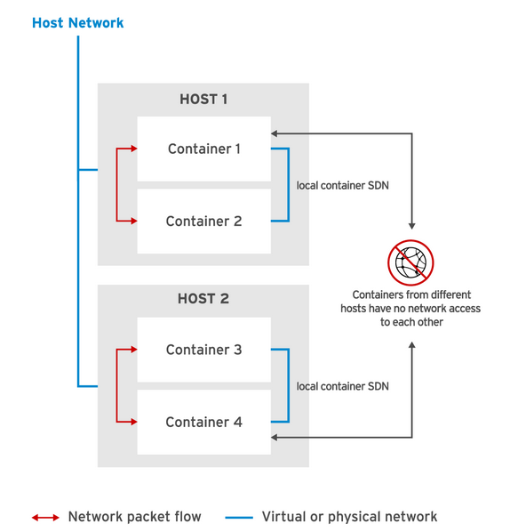

# 第3章 コンテナーの管理

## コンテナーのライフサイクルの管理

#### Podman によるコンテナーのライフサイクル管理

Podman では、コンテナーを実行するだけでなく、コンテナーをバックグラウンドで実行し、その内部で新しいプロセスを実行し、ファイルシステムボリュームやネットワークなどのリソースをコンテナーに提供することもできます。 

コンテナーを作成および管理するためのサブコマンドセットがあります。開発者はこれらのサブコマンドを使用して、コンテナーおよびコンテナーイメージのライフサイクルを管理します。

コンテナーとイメージの状態を変更するサブコマンドで最も使用頻度の高いものについて、次の図に概要を示します。 


Podman は、実行中および停止中のコンテナーに関する情報を入手するための便利なサブコマンドも提供します。 これらのサブコマンドを使用して、デバッグ、更新、または報告を行うためにコンテナーおよびイメージから情報を抽出することができます。

コンテナーとイメージの情報をクエリーするサブコマンドで最も使用頻度の高いものについて、次の図に概要を示します。 


- [マニュアル：第8章 コンテナーのコマンドライン参照](https://access.redhat.com/documentation/ja-jp/red_hat_enterprise_linux/8/html/building_running_and_managing_containers/container-command-line-reference_building-running-and-managing-containers)


#### コンテナーの作成

- podman run

イメージから新しいコンテナーを作成し、新しいコンテナー内でプロセスを開始します。

コンテナーイメージがローカルで利用できない場合、このコマンドは設定されたイメージリポジトリを使用してイメージをダウンロードしようとします。

- podman ps 

**Podman は、固有のコンテナー ID またはコンテナー名によってコンテナーを識別します。** podman ps コマンドで確認可能

コンテナーID：一意であり、自動的に作成

コンテナー名は手動で指定(podman run --nameオプション)できます。指定しない場合は自動的に生成されます。この名前は一意である必要があります。


- エントリーポイントのオーバーライド
コンテナーイメージは、エントリーポイントとして知られるコンテナー化プロセスを開始するために実行するコマンドを指定します。**podman run コマンドは、コンテナーイメージの後にコマンドを含めることで、このエントリーポイントをオーバーライドできます。**

ex) コンテナーイメージ内で実行可能なコマンドを指定できる。**ただし、コンテナーは httpd イメージのエントリーポイントをスキップします。そのため httpd サービスは起動しません。**
```
[student@workstation ~]$ sudo podman run rhscl/httpd-24-rhel7 ls /tmp
anaconda-post.log
ks-script-1j4CXN
yum.log
```


## コンテナーでのコマンドの実行 

- 使用例
    - すでに実行中のコンテナーで対話的なシェルを実行する。(/bin/bash)
    - コンテナーのファイルを更新または表示する(ls)プロセスを実行する。
    - コンテナー内で新しいバックグラウンドプロセスを開始する


#### 実行中のコンテナーでのコマンド実行

- podman exec 

ex1) 
```
[student@workstation ~]$ sudo podman exec 7ed6e671a600 cat /etc/hostname
7ed6e671a600
```

ex2) 対話型
```
[student@workstation ~]$ sudo podman run -it rhscl/httpd-24-rhel7 /bin/bash
bash-4.2#
```

#### -it オプションについてのメモ

-i および -t オプションは、対話的なテキストベースのプログラムのターミナルリダイレクトを有効にします。-t オプションは pseudo-tty (ターミナル) を割り当て、それをコンテナーの標準入力にアタッチします。-i オプションは、コンテナーが切り離されていても標準入力をオープンに保つので、メインプロセスは入力を待機し続けることができます。 


#### 実行しないで、コンテナーへのコマンド実行

ex) 詳細は上記参照
```
[student@workstation ~]$ sudo podman run rhscl/httpd-24-rhel7 ls /tmp
anaconda-post.log
ks-script-1j4CXN
yum.log
```


## コンテナーの管理

コンテナーの作成と起動は、コンテナーのライフサイクルの最初の手順にすぎません。

コンテナーのライフサイクルには、コンテナーの停止、再起動、または最終的な削除も含まれます。

- podman inspect
- podman stop
- podman kill (終了)
    - -s オプションでシグナルを指定できます。(たくさんある。)
    - [3.3. コンテナーの起動および停止](https://access.redhat.com/documentation/ja-jp/red_hat_enterprise_linux/8/html/building_running_and_managing_containers/starting-and-stopping-containers_building-running-and-managing-containers#stopping-containers_building-running-and-managing-containers)
- podman restart
- podman rm 
    - -f 起動中でも強制削除
    - -a 全削除


## ガイド付き演習: MySQL コンテナーの管理


## コンテナーへの永続ストレージの追加

#### 永続ストレージの場所の準備

コンテナーストレージは一時的なものです。つまり、コンテナーが削除された後は保存されません。

**一時的なコンテナーストレージでは、データベースのような、再起動後もデータを保持する必要のあるアプリケーションには不十分です。** 
このようなアプリケーションをサポートするために、管理者はコンテナーに永続ストレージを付与する必要があります。 


#### ホストディレクトリの準備

**Podman は実行中のコンテナー内にホストディレクトリをマウントすることができます。** 

それらのホストディレクトリはコンテナー化されたアプリケーションから、コンテナーストレージと見なされます。

しかし、これらのホストディレクトリの内容はコンテナーを停止した後に再利用されず、必要に応じて新しいコンテナーへマウントできます。 
たとえばデータベースコンテナーは、データベースファイルを保存するために、ホストディレクトリを使用することができます。このデータベースコンテナーが失敗した場合、データベースのデータをクライアントアプリケーションが使用できる状態にしたまま、Podman は同じホストディレクトリを使って新しいコンテナーを作成することができます。

コンテナーは、ホストオペレーティングシステムのユーザーとグループ ID を使って、ホストオペレーティングシステムのプロセスとして実行されます。

したがって、ホストディレクトリはコンテナーへのアクセスを許可する所有権とパーミッションを使って設定する必要があります。RHEL では、ホストディレクトリは適切な SELinux コンテキストを使って設定する必要もあります。このコンテキストは **container_file_t** です。Podman は container_file_t SELinux コンテキストを使用し、コンテナーがアクセスを許可されているホストシステムのファイルを制限します。これにより、ホストシステムとコンテナー内で実行されているアプリケーションの間で情報漏洩を回避できます。 

- セットアップ方法1

1. オーナーおよびグループ root でディレクトリを作成します。 

> [student@workstation ~]$ sudo mkdir /var/local/mysql

2. 書き込み権限の付与

ex) ホストマシンで同じユーザーが正確に定義されていない場合、パーミッションはコンテナーの数字のユーザー ID (UID) を使って定義してください。 Red Hat が提供する MySQL サービスの場合、UID は 27 になります。 

> [student@workstation ~]$ sudo chown -R 27:27 /var/local/mysql

[chownコマンド](https://webkaru.net/linux/chown-command/)

3. container_file_t コンテキストをディレクトリ (およびすべてのサブディレクトリ) に適用し、コンテナーがすべてのコンテンツにアクセスできるよう許可します。 

> [student@workstation ~]$ sudo semanage fcontext -a -t container_file_t '/var/local/mysql(/.*)?'

-  SELinux コンテナーポリシーを新しく作成したディレクトリに適用します。

> [student@workstation ~]$ sudo restorecon -Rv /var/local/mysql

**ホストディレクトリは、そのディレクトリを使用するコンテナーを起動する前に設定しておく必要があります。**


#### ボリュームのマウント

- ホストディレクトリを作成、設定したら、次にこのディレクトリをコンテナーへマウントします。

 podman run (コンテナー作成)コマンド実行時、-v オプションでホストディレクトリのパスとコンテナーストレージのパスを指定してコロン (:) で区切り指定

ex) MySQL サーバーデータベースファイルに /var/local/mysql ホストディレクトリを使用するときは、mysql という名前の MySQL コンテナーイメージ内の /var/lib/mysql/data の下位にくる。

> [student@workstation ~]$ sudo podman run --name persist-db -d -v /var/local/mysql:/var/lib/mysql/data -e MYSQL_USER=user1 -e MYSQL_PASSWORD=mypa55 -e MYSQL_DATABASE=items -e MYSQL_ROOT_PASSWORD=r00tpa55 rhscl/mysql-57-rhel7

マウントが削除されれば、元の内容にアクセス可能になる。

- マウウントの確認

> [student@workstation ~]$ ls -l /var/local/mysql
```
total 41032
-rw-r-----. 1 27 27       56 Jun 13 07:50 auto.cnf
-rw-------. 1 27 27     1676 Jun 13 07:50 ca-key.pem
-rw-r--r--. 1 27 27     1075 Jun 13 07:50 ca.pem
-rw-r--r--. 1 27 27     1079 Jun 13 07:50 client-cert.pem
-rw-------. 1 27 27     1680 Jun 13 07:50 client-key.pem
-rw-r-----. 1 27 27        2 Jun 13 07:51 e89494e64d5b.pid
-rw-r-----. 1 27 27      349 Jun 13 07:51 ib_buffer_pool
-rw-r-----. 1 27 27 12582912 Jun 13 07:51 ibdata1
-rw-r-----. 1 27 27  8388608 Jun 13 07:51 ib_logfile0
-rw-r-----. 1 27 27  8388608 Jun 13 07:50 ib_logfile1
-rw-r-----. 1 27 27 12582912 Jun 13 07:51 ibtmp1
drwxr-x---. 2 27 27       20 Jun 13 07:50 items (このディレクトリは、このコンテナーが作成した items データベースに関連するデータを格納します。)
drwxr-x---. 2 27 27     4096 Jun 13 07:50 mysql
drwxr-x---. 2 27 27     8192 Jun 13 07:50 performance_schema
-rw-------. 1 27 27     1680 Jun 13 07:50 private_key.pem
-rw-r--r--. 1 27 27      452 Jun 13 07:50 public_key.pem
-rw-r--r--. 1 27 27     1079 Jun 13 07:50 server-cert.pem
-rw-------. 1 27 27     1676 Jun 13 07:50 server-key.pem
drwxr-x---. 2 27 27     8192 Jun 13 07:50 sys
```

## ガイド付き演習: MySQL データベースの永続化

学習内容は上記に含める、重複＆見やすさの為


## コンテナーへのアクセス

#### コンテナーを使ったネットワーキングの紹介

Podman は CNI(Container Network Interface) プロジェクトを使用して、各ホストでコンテナーのソフトウェア定義ネットワーク (SDN) を実装しています。

Podman は各コンテナーを仮想ブリッジにアタッチし、各コンテナーにプライベート IP アドレスを割り当てます。


Podman の CNI 設定を指定する設定ファイルは、/etc/cni/net.d/87-podman-bridge.conflist です。 




- 同じホスト上のコンテナー

Podmanは各コンテナーに固有の IP アドレスを割り当て、それらすべてを同じソフトウェア定義ネットワークに接続します。これらのコンテナーは、IP アドレスによって互いに自由に通信できます。

- 異なるホスト上のコンテナー

異なるソフトウェア定義ネットワークに属します。

各 SDN は分離されているため、あるネットワーク内のコンテナーが別のネットワーク内のコンテナーと通信することはできません。

- デフォルト

すべてのコンテナーネットワークがホストネットワークから隠されている。つまり、コンテナーは通常ホストネットワークにアクセスできますが、明示的な設定がないと、コンテナーネットワークにアクセスすることはできません。 


#### ネットワークポートのマッピング

ホストネットワークからコンテナーにアクセスすることが難しい場合があります。 

- コンテナーには、利用可能なアドレスのプールから IP アドレスが割り当てられています。コンテナーが破棄されると、コンテナーのアドレスは利用可能なアドレスのプールに解放されます。
- コンテナーのソフトウェア定義ネットワークは、コンテナーホストによってのみアクセスできるということです。 

これらを解決するために、**コンテナーサービスへの外部アクセスを許可するようにポートフォワーディングルールを定義します。-p [<IP address>:][<host port>:]<container port> オプション**

ex1) ホスト上のポート 8080 への**要求がすべて** コンテナー内のポート 80 に転送されるように指定。

> sudo podman run -d --name apache1 -p 8080:80 rhscl/httpd-24-rhel7:2.4

**-pで<IP address>を指定しないことで、ホストネットワークや異なるホスト上のコンテナーなどの外部からの要求を受け入れられる。以下の図を参照**


ex2) -pで<IP address>を指定することで、**特定のIPアドレスからのみ要求を受け入れる。**

> sudo podman run -d --name apache2 -p 127.0.0.1:8081:80 rhscl/httpd-24-rhel7:2.4


ex3) ホストポート用の<host port>が指定されていない場合、Podman はコンテナーの使用可能なホストポートを無作為に割り当てます。

> sudo podman run -d --name apache3 -p 127.0.0.1::80 rhscl/httpd-24-rhel7:2.4

- Podman が割り当てたポートを確認

> sudo podman port apache3(コンテナー名)

> sudo podman inspect | grep IPAddress

ex4) -p オプションによってコンテナーポートのみが指定されている場合、ランダムに利用可能なホストポートがコンテナーに割り当てられ、任意(なんでも)の IP アドレスからこの割り当てられたホストポートへの要求は、コンテナーポートに転送されます。

> sudo podman run -d --name apache4 -p 80 rhscl/httpd-24-rhel7:2.4

> sudo podman port apache4
```
80/tcp -> 0.0.0.0:37068 (ホストポート 37068 へのルーティング可能な要求がコンテナーのポート 80 に転送されます。 )
```


## オープン・ラボ: コンテナーの管理

特になし

