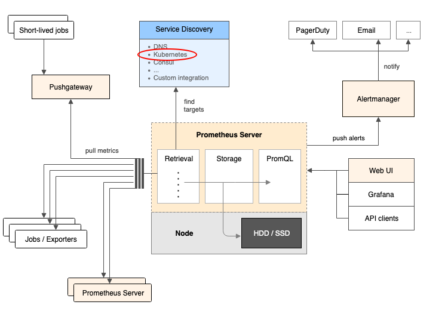
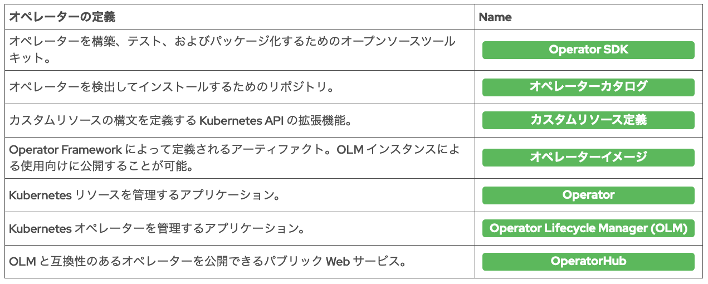

# 第1章 Red Hat OpenShift Container Platform の説明

## OpenShiftの機能紹介

#### 高可用性

高可用性 etcd クラスターには、OpenShift クラスターとそのアプリケーションの状態が格納されます。

etcd に保存されたリソース (デプロイ設定など) は、アプリケーションが常に実行されていることと、障害のあるコンテナーが終了していることを確認するために、コンテナーの自動再起動を提供します。これは、アプリケーションだけでなく、Web コンソールや内部イメージレジストリなどの、クラスターを構成するコンテナー化サービスにも適用されます。 


#### 軽量OS

RHOCP は、俊敏性、移植性、セキュリティーに重点を置いたRedHatの軽量オペレーティングシステムである Red Hat Enterprise Linux CoreOS 上で実行されます。RHOCP は RHEL CoreOS への更新とその設定を制御します。


#### 負荷分散(ロードバランシング)

クラスターは3種類のロードバランサーを提供します。
    1. OpenShift API へのアクセスを管理する外部ロードバランサー
    2. 外部アクセスアプリケーション用の HAProxy ロードバランサー
    3. アプリケーションとサービスへの内部アクセスについて netfilter ルールを使用する内部ロードバランサー


#### オートスケーリング

新しいコンテナーを自動的に起動し、ロードが減少するとコンテナーを終了することで、アプリケーショントラフィックの増加にリアルタイムで適応できます。この機能により、同時接続やアクティビティーの数に関係なく、アプリケーションのアクセス時間が最適に保たれます。 

多くのアプリケーションからの集計ロードに応じて、より多くのワーカーノードをクラスターに追加したりクラスターから削除したりすることもできます。これにより、パブリック/プライベートクラウドの応答性とコスト削減が保持されます。 

- 問題5. より

OpenShift は、Prometheusのメトリクスを使用して、アプリケーションポッドを動的にスケーリングする。

- [10分で理解する Prometheus](https://qiita.com/Chanmoro/items/ac0eb1bf93760566b338)より、抜粋
```
Prometheusは、プル型のリソース監視ソフトウェア。

できること
    ・監視対象のサーバーから情報を取得 & 保管
    ・保管済みデータに対して集計クエリを発行できる
    ・しきい値を超えた場合のアラート (メール、Slack、がんばればTwilioで電話)
    ・柔軟なアラート設定 (同じエラーはまとめて通知とかの設定ができる)
```



#### ログとモニタリング

RHOCP には、クラスターに関して数百のメトリクスを収集する、Prometheus ベースの高度なモニタリングソリューションが付属しています。このソリューションは、クラスターのアクティビティーとヘルスに関する詳細情報を取得できるアラートシステムと連携します。 

RHOCP には、クラスターノードやコンテナーからのログを長期間保存できる、Elasticsearch ベースの高度な集計ログソリューションが付属しています。 


#### サービス検出

RHOCP は、クラスター上で内部 DNS サービスを実行し、その内部 DNS を使用して名前解決するための設定を、すべてのコンテナーに対して行います。

-> アプリケーションは、外部サービスカタログのオーバーヘッド(上書き)を発生させることなく、フレンドリーな名前を使用して他のアプリケーションやサービスを検索できます。 


#### ストレージ

Kubernetes は、ストレージバックエンドとストレージ利用の間に抽象化レイヤーを追加します。そのため、アプリケーションは、**ストレージバックエンドから独立した統一されたストレージ定義**を使用して、長寿命、短寿命、ブロック、およびファイルベースのストレージを利用することができます。したがって、アプリケーションが特定のクラウドプロバイダーのストレージ API に依存することはありません。 


#### アプリケーション管理

RHOCP により、開発者はアプリケーションの開発とデプロイを自動化できるようになります。**ソースコードに基づいてコンテナーを自動的に構築して OpenShift で実行するには、OpenShift Source-to-Image (S2I) 機能**を使用します。内部レジストリにはアプリケーションコンテナーイメージが保存される。これは再利用可能です。これにより、アプリケーションの公開にかかる時間が短縮されます。

Web コンソールからアクセスできる開発者用カタログは、アプリケーションテンプレートの公開およびアクセスのための場所です。 Python、Ruby、Java、Node.js などの多くのランタイム言語に対応しており、データベースおよびメッセージングサーバーもサポートしています。

新しいオペレーターをインストールすることでカタログを拡張できます。**オペレーターとは、アプリケーションをデプロイ、更新、モニタリングするための運用インテリジェンスが埋め込まれた、事前パッケージ化済みのアプリケーションとサービス**です。 


#### クラスターの拡張

RHOCP は、Kubernetes の標準拡張メカニズム (拡張 API やカスタムリソース定義など) を利用して、これ以外の方法ではアップストリーム Kubernetes から利用できない機能を追加します。OpenShift は、インストール、更新、および管理が容易になるように、これらの拡張機能をオペレーターとしてパッケージ化します。

OpenShift には Operator Lifecycle Manager (OLM) も含まれています。これにより、オペレーターとしてパッケージ化されたアプリケーションおよびインフラストラクチャーコンポーネントの検出、インストール、更新が容易になります。

Red Hat は、AWS、Google Cloud、Microsoftと協力して、オペレーターハブを立ち上げました (https://operatorhub.io でアクセス可能)。このプラットフォームは、OpenShift および OLM を含むその他の Kubernetes ディストリビューションと互換性がある、オペレーター向けのパブリックリポジトリおよびマーケットプレイスです。 


## OpenShift Container Platform アーキテクチャの説明

#### Kubernetesの宣言型アーキテクチャの概要

OpenShift のアーキテクチャは、Kubernetes の宣言的な特性に基づいています。
ほとんどのシステム管理者にとっては、特定のサーバーでコンテナーを起動および停止するなど、システムの状態を間接的に変更するアクションを実行する、命令型アーキテクチャが一般的となっています。
宣言型アーキテクチャでは、新しい状態に合わせるために、システムの状態とシステムの更新自体を変更します。たとえば、Kubernetes では、特定のコンテナーを特定の条件下で実行するよう指定するポッドリソースをユーザーが定義します。その場合に、Kubernetes は、特定の条件下でそのコンテナーを実行できるサーバー (ノード) を探します。

**宣言型アーキテクチャにより、命令型アーキテクチャよりも簡単に管理できる自己最適化および自己修復システムが実現します。**

Kubernetes は、クラスターの状態 (デプロイされるアプリケーションのセットなど) を、etcd データベースに保存される一連のリソースとして定義します。Kubernetes は、これらのリソースをモニタリングしてクラスターの現在の状態と比較するコントローラーも実行します。これらのコントローラーは、クラスターの状態をリソースの状態に合わせて調整するために必要なアクションを実行します。たとえば、新しいポッドリソースから新しいコンテナーを起動できるだけの十分な CPU 能力を備えたノードを探したりします。

Kubernetes は、これらのリソースを管理するための REST API を提供します。
**OpenShift ユーザーがコマンドラインインターフェースまたは Web コンソールを使用して行うすべてのアクションは、この REST API を呼び出すことで実行されます。**


#### OpenShift コントロールプレーンの概要

Kubernetes クラスターは、kubelet システムサービスとコンテナーエンジンを実行する一連のノードで構成されています。
OpenShift は、CRI-O コンテナーエンジンを排他的に実行します。 

**kubeletエージェント**は、ノードの設定に応じて異なる静的ポッドのセットを起動します。
静的ポッドとは、起動時に API サーバーへの接続を必要としないポッドです。kubelet エージェントはポッドのライフサイクルを管理します。静的ポッドは、スケジューラーなどのコントロールプレーンサービス、またはソフトウェア定義ネットワーク (SDN) などのノードサービスのいずれかを提供できます。
OpenShift には、これらの静的ポッドのためのポッドリソースを作成して通常のポッドのようにモニタリングできるようにするオペレーターが用意されています。 


#### OpenShift 拡張機能の説明

Kubernetes の機能の多くは、入力コントローラー、ストレージプラグイン、ネットワークプラグイン、認証プラグインなどの外部コンポーネントに依存しています。
Kubernetes の機能の多くは、アクセスコントロールやネットワーク分離などの拡張 API にも依存しています。

OpenShift は、統合および設定済みでありオペレーターによって管理される数多くのコンポーネントを提供する Kubernetes ディストリビューションです。OpenShift には、コンテナーイメージレジストリや Web コンソールなど、オペレーターによって管理されるプリインストールアプリケーションも用意されています。

OpenShift は、一連の拡張 API とカスタムリソースも Kubernetes に追加します。たとえば、Source-to-Image プロセス向けのビルド設定や、クラスターへの外部アクセスを管理するためのルートリソースなどです。


#### OpenShift のデフォルトストレージクラスの概要

クラウドネイティブのステートレスアプリケーションを中心としている多くのコンテナープラットフォームとは異なり、OpenShiftでは、標準的Twelve-Factor App方法論に基づいていないステートフルアプリケーションもサポートされています。

- [ステートレスアプリケーション](https://cloud.google.com/kubernetes-engine/docs/how-to/stateless-apps?hl=ja)
```
データやアプリケーションの状態をクラスタや永続ストレージに保存しないアプリケーションです。代わりに、データとアプリケーションの状態はクライアントに保持されるため、ステートレス アプリケーションはスケーラビリティが高くなります。
```

- [ステートフルアプリケーション](https://cloud.google.com/kubernetes-engine/docs/how-to/stateful-apps?hl=ja)
```
サーバー、クライアント、およびその他のアプリケーションが使用するデータを永続ディスク ストレージに保存します。ステートフル アプリケーションの例としては、他のアプリケーションがデータの保存先および取得元として使用するデータベースや Key-Value ストアが挙げられます。
```
OpenShift は、ストレージ機能とサポートオペレーターを包括的セットとして提供することでステートフルアプリケーションをサポートします。


OpenShift には、基盤となるクラウドまたは仮想化プラットフォームに依存して動的プロビジョニング済みストレージを提供する、統合ストレージプラグインとストレージクラスが付属しています。たとえば、Amazon Web Services (AWS) に OpenShift をインストールすると、OpenShift クラスターには、AWS EBS(Amazon Elastic Block Store：Amazon EC2インスタンスに接続できるブロックレベルのストレージ)サービスを自動的に使用してストレージボリュームをオンデマンド(=需要に応じて)でプロビジョニングするデフォルトのストレージクラスが事前設定されます。ユーザーは、データベースなどの、永続ストレージを必要とするアプリケーションをデプロイします。そして OpenShift は、アプリケーションデータをホストする EBS ボリュームを自動的に作成します。

OpenShift クラスター管理者は、異なる EBS サービス層を使用する追加のストレージクラスを後で定義できます。たとえば、高い入出力操作 (IOPS) 率が維持される高パフォーマンスのストレージに 1 つのストレージクラスを使用し、パフォーマンスの低い低コストのストレージには別のストレージクラスを使用することが可能です。その場合、クラスター管理者は、高パフォーマンスのストレージクラスの使用を特定のアプリケーションのみに許可し、データアーカイブアプリケーションは低パフォーマンスのストレージクラスを使用するよう設定することができます。 


## クラスターオペレーターの説明

#### Kubernetes オペレーターの概要

**Kubernetes オペレーターとは、Kubernetes API を呼び出して Kubernetes リソースを管理するアプリケーションです。**

Kubernetes アプリケーションの場合、オペレーターのデプロイは、オペレーターのコンテナーイメージを参照するサービスやデプロイなどの Kubernetes リソースを定義することによって行います。 オペレーターでは、一般的なアプリケーションとは異なり Kubernetes リソースへの直接アクセスを必要とするため、通常、カスタムのセキュリティー設定が必要になります。

オペレーターは通常、設定と構成を保存するカスタムリソース (CR) を定義します。OpenShift 管理者は、そのカスタムリソースを編集することによりオペレーターを管理します。カスタムリソースの構文は、カスタムリソース定義 (CRD) によって定義されます。

ほとんどのオペレーターは、別のアプリケーションを管理します。たとえば、データベースサーバーを管理するオペレーターなどがあります。この場合、オペレーターは、カスタムリソースからの情報を使用して、その別のアプリケーションを記述するリソースを作成します。

通常、オペレーターの目的は、人間の管理者 (または人間のオペレーター) がアプリケーションのデプロイ、更新、および管理のために実行するタスクを自動化することです。 


#### Operator Framework の概要

オペレーターは、自分で選んだプログラミング言語を使用して開発できます。
技術的には、オペレーターの開発には特殊用途の SDK は必要ありません。必要なのは、REST API を呼び出して Kubernetes API へのアクセス資格情報を含むシークレットを使用する機能だけです。

Operator Framework は、オペレーターを構築、テスト、およびパッケージ化するためのオープンソースツールキットです。Operator Framework は、以下のコンポーネントを提供することで、低レベル Kubernetes API に直接コーディングするよりも簡単にこれらのタスクを行えるようにします。 

- Operator Software Development Kit (Operator SDK)
```
オペレーターアプリケーションに共通のパターンを実装する一連の Go言語ライブラリとソースコードの例を提供します。また、Ansible を使用したオペレーター開発を可能にするコンテナーイメージとプレイブックの例も提供します。 
```

- Operator Life Cycle Manager (OLM)
```
オペレーターカタログを通じてデプロイされたオペレーターのデプロイ、リソース使用率、更新、削除を管理するアプリケーションを提供します。OLM 自体が、オペレーターとしてあらかじめ OpenShift にインストールされています。 
```

Operator Framework はまた、オペレーターと CRD の実装に推奨される一連のプラクティスや、オペレーターカタログを使用してオペレーターを配布できるようにするオペレーターマニフェストをコンテナーイメージとしてパッケージ化する標準的な方法も定義します。オペレーターカタログの最も一般的な形式は、イメージレジストリサーバーです。

Operator Framework 標準に基づくオペレーターコンテナーイメージには、オペレーターアプリケーションのデプロイに必要なすべてのリソース定義が含まれています。このようにして、OLM は自動的にオペレーターをインストールできます。Operator Framework 標準に基づいてビルドおよびパッケージ化されたオペレーターではない場合、OLM はそのオペレーターをインストールしたり管理したりすることができません。

- OperatorHub の概要
```
OperatorHub は、Operator Framework 標準に基づくオペレーターを検出して公開するための Web インターフェースを提供します。Operator hub には、オープンソースオペレーターと市販オペレーターの両方を公開できます。オペレーターコンテナーイメージは、たとえば Quay.io など、異なるイメージレジストリでホストできます。 
```


#### OpenShift クラスターオペレーターの概要

クラスターオペレーターは、通常のオペレーターとほぼ同じですが、OLM によって管理されないという違いがあります。

これらは OpenShift Cluster Version Operator によって管理されます。これは、第 1 レベルのオペレーターと呼ばれることもあります。また、すべてのクラスターオペレーターが、第 2 レベルのオペレーターとも呼ばれます。

OpenShift クラスターオペレーターは、下記のような OpenShift 拡張 API とインフラストラクチャサービスを提供します。

- OAuth サーバー。マスターおよび拡張 API へのアクセスを認証します。
- コア DNS サーバー。クラスター内のサービス検出を管理します。
- Web コンソール。クラスターを視覚的に管理できます。
- 内部イメージレジストリ。S2I または別のメカニズムを使用して、クラスター内のコンテナーイメージをホストできるようにします。
- モニタリングスタック。クラスターの健全性に関するメトリクスとアラートを生成します。 

一部のクラスターオペレーターは、ノードやコントロールプレーンの設定を管理します。たとえば、アップストリーム Kubernetes では、ノード設定ファイルを編集してストレージとネットワークプラグインを追加します。これらのプラグインには追加の設定ファイルが必要になる場合があります。OpenShift では、すべてのノード内の設定ファイルの管理と、これらのファイルの変更の影響を受けるノードサービスのリロードを行うオペレーターがサポートされています。 


#### OpenShift クラスターオペレーターの詳細

通常、オペレーターとその管理対象アプリケーションは、同じプロジェクトを共有します。クラスターオペレーターの場合、これらは openshift-* プロジェクトに含まれています。

クラスターオペレーターはすべて、ClusterOperator タイプのカスタムリソースを定義します。クラスターオペレーターは、API サーバー、Web コンソール、ネットワークスタックなどの、クラスター自体を管理します。各クラスターオペレーターは、一連のカスタムリソースを定義して、そのコンポーネントをさらに詳細に制御します。ClusterOperator API リソースは、更新の健全性またはコンポーネントのバージョンなどの情報を公開します。 



#### 参照

- [あまり良く知られていない Kubernetes Operator とは？](https://qiita.com/MahoTakara/items/af4ad8ab69c24102bd72)