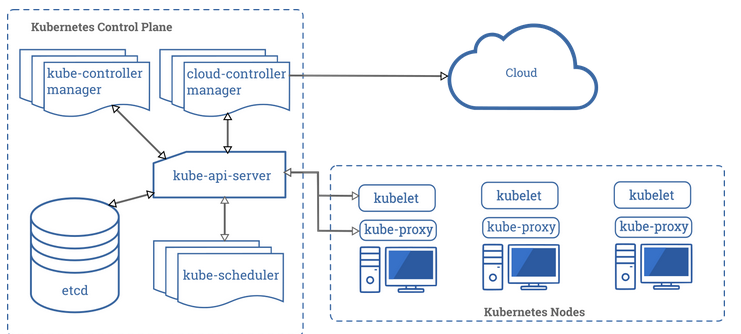

# 第2章 クラスターの検証

## インストール方法の説明

#### OpenShift のインストール方法の概要

Red Hat Openshift Container Platform は、主なインストール手段として次の 2 種類の方法を提供します。

- フルスタック自動化

この方法では、クラウドまたは仮想化プロバイダーからのすべてのコンピューティングリソース、ストレージリソース、ネットワークリソースを、OpenShift インストーラーがプロビジョニングします。ユーザーは、クラウドプロバイダーへの資格情報や初期クラスターのサイズなどの最小限のデータをインストーラーに指定します。すると、インストーラーが、機能を完全に備えた OpenShift クラスターをデプロイします。 

- 既存インフラストラクチャ

この方法では、ユーザーがコンピューティングリソース、ストレージリソース、ネットワークリソースのセットを設定し、OpenShift インストーラーがこれらのリソースを使用して初期クラスターを設定します。

**この方法を使用すると、フルスタック自動化方法ではサポートされないベアメタルサーバーとクラウドまたは仮想化プロバイダーを使用して OpenShift クラスターを設定することが可能になります。**

既存インフラストラクチャを使用する場合は、ブートストラップノードを含むすべてのクラスターインフラストラクチャおよびリソースを提供する必要があります。インストールプログラムを実行して必要な設定ファイルを生成した後、再度インストールプログラムを実行して OpenShift クラスターをインフラストラクチャにデプロイする必要があります。 

フルスタック自動化方法を使用すると、新しいクラスターのすべてのノードが Red Hat Enterprise Linux CoreOS (RHEL CoreOS) を実行します。
既存インフラストラクチャ方式を使用すると、Red Hat Enterprise Linux (RHEL) を使用してワーカーノードをセットアップできますが、コントロールプレーン (マスターノード)には引き続き RHEL CoreOS が必要です。

- マスターノード？、ワーカーノード？
    - [Kubernetesのコンポーネント](Kubernetesのコンポーネント)より、抜粋

Kubernetesをデプロイすると、クラスターが展開されます。
**クラスターは、 コンテナ化されたアプリケーションを実行する、ノードと呼ばれるワーカーマシンの集合です。すべてのクラスターには少なくとも1つのワーカーノードがあります。**

ワーカーノードは、アプリケーションワークロードのコンポーネントであるPodをホストします。
コントロールプレーン(マスターノード)は、クラスター内のワーカーノードとPodを管理します。本番環境では、コントロールプレーンは複数のコンピューターを使用し、クラスターは複数のノードを使用し、耐障害性や高可用性を提供します。

各コンポーネントの詳細は上記リンクを参照。

#### デプロイプロセスの説明

インストールは、インストーラーが生成するアセットを使用して Red Hat Enterprise Linux CoreOS を実行するブートストラップマシンの作成を始めとして、いくつかの段階で行われます。

クラスターのブートストラッププロセスは次のとおりです。

1. ブートストラップマシンがブートし、その後、コントロールプレーンマシンのブートに必要なリモートリソースのホスティングを開始します。

2. コントロールプレーンマシンがブートストラップマシンからリモートリソースを取得し、ブートを完了します。

3. コントロールプレーンマシンが Etcd クラスターを形成します。

4. ブートストラップマシンが、新しく作成された Etcd クラスターを使用して、一時的な Kubernetes コントロールプレーンを起動します。

5. 一時的なコントロールプレーンによって、コントロールプレーンのスケジュールがコントロールプレーンマシンに設定されます。

6. 一時的なコントロールプレーンがシャットダウンし、コントロールプレーンに後を譲ります。

7. ブートストラップノードが、OpenShift 固有のコンポーネントをコントロールプレーンに挿入します。

8. 最後に、インストーラーがブートストラップマシンを破棄します。 

このブートストラッププロセスが行われた結果、完全稼働する OpenShift コントロールプレーンが得られます。これには、API サーバー、コントローラー (SDN など)、Etcd クラスターが含まれます。その後、クラスターは、Cluster Version Operator を通じて、日常の運用に必要な残りのコンポーネントをダウンロードして設定します (サポート対象プラットフォームでのコンピューティングマシンの自動作成など)。 

#### OpenShift インストールのカスタマイズ

**OpenShift インストーラーでは、プロビジョニングする初期クラスターに対して実施可能なカスタマイズは、ほとんどありません。**
ほとんどのカスタマイズはインストール後に実行されます。

---
## トラブルシューティングコマンドの実行 

#### OpenShift クラスターでの一般的な問題のトラブルシューティング

OpenShift クラスターのトラブルシューティングのほとんどは、アプリケーションのデプロイメントのトラブルシューティングと非常によく似ています。

- OpenShift ノードの健全性の検証

次のコマンドは、OpenShift クラスター内のノードのステータスと健全性に関する情報を表示します。

> oc get nodes    

各ノードのステータスの列が表示されます。ノードが Ready でない場合は、OpenShift コントロールプレーンと通信できず、クラスターに対して実質的には無効になっています。 

> oc adm top nodes

各ノードの現在の CPU とメモリー使用率を表示します。これらは実際の使用率であり、OpenShift スケジューラーによってノードの使用可能容量および使用済み容量と見なされるリソース要求ではありません。 

> oc describe node my-node-name

スケジューラーの観点から使用可能なリソースと使用済みのリソース、およびその他の情報を表示します。出力の中から「Capacity」、「Allocatable」、「Allocated resources」という見出しを探します。見出しの「Conditions」は、ノードのメモリー負荷、ディスク負荷、またはその他の条件によって、ノードが新しいコンテナーを起動しないようにするかどうかを示しています。 

#### OpenShift ノードでのシェルプロンプトの起動

Red Hat Openshift Cluster Platform 3 および Kubernetes のその他のディストリビューションを管理する管理者は、ノードへの SSH セッションを頻繁に開いて、コントロールプレーンやコンテナーエンジンの状態を調べたり、設定ファイルを変更したりすることができます。
これはまだ実施可能ですが、Red Hat Openshift Cluster Platform 4 では推奨されません。 

> oc debug node

クラスターの任意のノードでシェルプロンプトを開くことができます。
このプロンプトは、ノードルートファイルシステムを /host フォルダーにマウントする専用のツールコンテナーから取得し、ノードのファイルを検査できます。 

#### アプリケーションデプロイメントのトラブルシューティング 

- 起動に失敗したポッドのトラブルシューティング

一般的なシナリオとして、OpenShift がポッドを作成し、ポッドが Running 状態を確立していないことが挙げられます。これは、OpenShift がそのポッド内のコンテナーを起動できなかったことを意味します。oc get pod と oc status コマンドを使用してトラブルシューティングを開始し、ポッドとコンテナーが実行されているかどうかを確認します。ある時点で、ポッドが ErrImagePull や ImagePullBackOff などのエラー状態になっています。

このような状態になった場合は、最初の手順として、oc get events コマンドを使用し、現在のプロジェクトからのイベントを一覧表示します。プロジェクトに多数のポッドが含まれている場合は、oc describe pod コマンドを使用してポッドによってフィルタリングされるイベントのリストを取得できます。デプロイメントとデプロイメント設定によってイベントをフィルタリングするために、同様の oc describe コマンドを実行することもできます。

- 実行中および終了したポッドのトラブルシューティング

もう 1 つの一般的なシナリオは、OpenShift でポッドを作成し、短時間では問題が発生しないことです。ポッドが Running 状態になります。これは、少なくとも 1 つのコンテナーが実行を開始したことを意味します。その後、いずれかのポッドコンテナー内で実行されているアプリケーションが動作を停止します。これにより、終了するか、ユーザーの要求に対してエラーメッセージが返される場合があります。

適切に設計されたデプロイメントでアプリケーションを管理する場合は、最終的にアプリケーションを終了させ、コンテナーを停止するヘルスプローブを含める必要があります。その場合に、OpenShift はコンテナーを数回再起動しようとします。ヘルスプローブやその他の理由によりアプリケーションが引き続き終了している場合、ポッドは CrashLoopBackOff 状態のままになります。

非常に短い時間であっても実行中のコンテナーはログを生成します。これらのログはコンテナーが終了しても破棄されません。
oc logs コマンドは、ポッド内の任意のコンテナーからログを表示します。ポッドに 1 つのコンテナーが含まれている場合、oc logs コマンドに必要なのはポッドの名前のみです。 

- OpenShift の集約ロギングの概要

Red Hat Openshift Container Platform 4 はクラスターのログサブシステムを提供します。Elasticsearch、Fluentd または Rsyslog、Kibana を基に、クラスターとそのコンテナーからのログを集計します。

OpenShift クラスターのログサブシステムをそのオペレーターによってデプロイして設定することは、このコースの範囲外です。詳細は、本セクションの末尾にある参照をご覧ください。 

- トラブルシューティングポッドの作成

問題がアプリケーションコンテナーイメージに関連しているか、OpenShift リソースから取得した設定に関係しているかを確認できない場合は、oc debug コマンドが非常に役立ちます。このコマンドは、ワークロード API の既存のポッド、デプロイメント設定、デプロイメント、またはその他のリソースに基づいてポッドを作成します。 

- 実行中のコンテナーの変更

コンテナーイメージは変更不可で、コンテナーは一時的であると想定されているため、実行中のコンテナーを変更することは推奨されません。ただし、これらの変更を加えることは、アプリケーションの問題のトラブルシューティングに役立つことがあります。実行中のコンテナーを変更した後、忘れずに同じ変更をコンテナーイメージとそのアプリケーションリソースに適用してから、永続的な修正が期待どおりに機能することを確認してください。

次のコマンドは、実行中のコンテナーの変更に役立ちます。これらはすべて、ポッドに 1 つのコンテナーが含まれていると想定しています。
それ以外の場合は、-c my-container-name オプションを追加する必要があります。

> oc rsh my-pod-name

ポッド内のシェルを開き、シェルコマンドを対話的および非対話的に実行します。 

> oc cp /local/path my-pod-name:/container/path

ローカルファイルをポッド内の場所にコピーします。引数を逆にして、ポッド内のファイルをローカルファイルシステムにコピーすることもできます。複数のファイルを一度にコピーするための oc rsync コマンドも参照してください。 

> oc port-forward my-pod-name local-port:remote-port

ワークステーションの local-port からポッドの local-port に TCP トンネルを作成します。oc port-forward が稼働している限り、トンネルはアクティブです。これにより、ルートを通じて公開せずに、ポッドへのネットワークアクセスを実現できます。トンネルは localhost で開始されるため、他のマシンからアクセスすることはできません。 

#### OpenShift CLI のトラブルシューティングコマンド

場合によっては、oc コマンドが失敗した理由を把握できないことがあります。そのため、低レベルのアクションをトラブルシューティングして原因を見つける必要があります。oc コマンドの特定の呼び出しがどのようにバックグラウンドで実行されているかを知る必要があるかもしれません。それには、Openshift と Kubernetes API 要求を行う自動化ツール (k8s モジュールを使用する Ansible Playbook など) で動作を複製することができます。

--loglevel level オプションを指定すると、レベル 6 から開始して OpenShift API 要求が表示されます。レベルを上げると (最大 10)、HTTP リクエストヘッダーや応答本文など、これらのリクエストに関する詳細な情報が追加されます。レベル 10 には、各要求を複製する curl コマンドも含まれています。 

#### troubleshootの自分まとめ

Red Hat Enterprise Linux CoreOS をベースにした OpenShift ノードでは、ノードに直接アクセスしてステータスを確認するために必要なローカルサービスがほとんど実行されていません。

Red Hat Enterprise Linux CoreOS のほとんどのシステムサービスはコンテナーとして動作します。これらのログは、エンドユーザーアプリケーションのログを表示するのと同じ方法で表示できます。

> oc get nodes 
> oc adm top nodes
> oc describe node my-node-name

主な例外として、**CRI-O コンテナーエンジン**と **Kubelet** があります。これらは Systemd ユニットです。

> oc adm node-logs -u crio my-node-name
> oc adm node-logs -u kubelet my-node-name

クラスターの任意のノードでシェルプロンプトを開くことができます。

> oc debug node/my-node-name