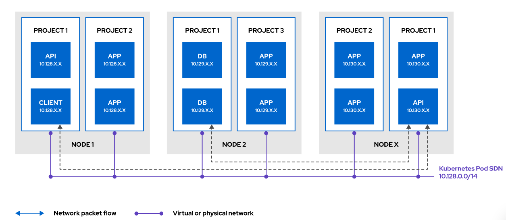
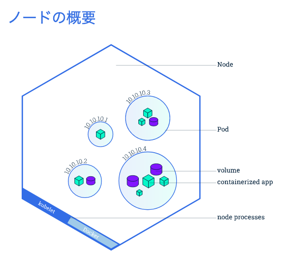
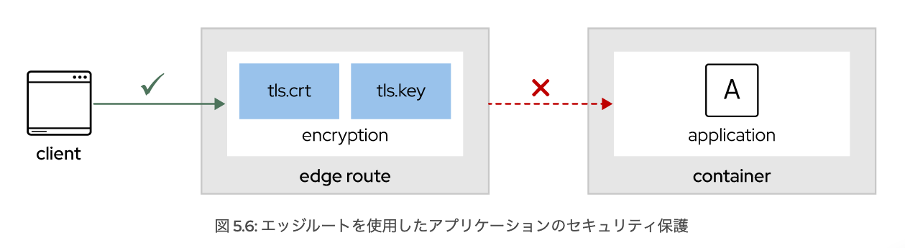
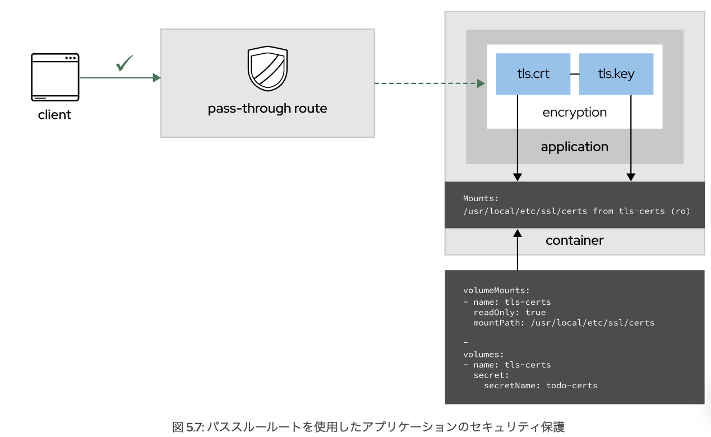

# 第5章 OpenShift ネットワークコンポーネントの設定

## OpenShift のソフトウェア定義ネットワークのトラブルシューティング

コマンドラインインターフェースを使用して OpenShift のソフトウェア定義ネットワークをトラブルシューティングできるようになります。 

#### OpenShift のソフトウェア定義ネットワークの概要

OpenShift はソフトウェア定義ネットワーク (SDN) を実装して、クラスターおよびユーザーアプリケーションのネットワークインフラストラクチャを管理します。
ソフトウェア定義ネットワーク(SDN)とは、いくつかのネットワーク層を抽象化してネットワークサービスを管理できるようにしたモデルのことです。トラフィックを処理するソフトウェア (コントロールプレーン) とトラフィックをルーティングする基本メカニズム (データプレーン) を分離します。

OpenShift Container Platform で、SDN は以下の 5 つの要件を解決します。

- 組織内のチームがアプリケーションの公開方法を決定できるように、ネットワークトラフィックとネットワークリソースをプログラムで管理する。

- 同じプロジェクト内で実行されているコンテナー間の通信を管理する。

- 同じプロジェクトに属しているか別のプロジェクトで実行されているかにかかわらず、ポッド間の通信を管理する。

- ポッドからサービスへのネットワーク通信を管理する。

- 外部ネットワークからサービス、またはコンテナーから外部ネットワークへのネットワーク通信を管理する。 

#### OpenShift ネットワークモデルについて

OpenShift SDN は Linux の名前空間を使用して、物理および仮想ホスト上のリソースとプロセスの使用を分割します。
この実装により、ポッド内のコンテナーはネットワークリソース (デバイス、IP スタック、ファイアウォールルール、ルーティングテーブルなど) を共有できます。

OpenShift SDN により、ルーティング可能な一意の IP が各ポッドに割り当てられるため、同じネットワーク内の他のサービスからポッドにアクセスすることができます。 

#### レガシーアプリケーションの移行

SDN 設計では、アプリケーションコンポーネントの相互通信方法を変更する必要がないため、レガシーアプリケーションを簡単にコンテナー化できます。

TCP/UDP スタックを介して通信する多数のサービスでアプリケーションが構成されている場合も、ポッド内のコンテナーが同じネットワークスタックを共有するのでこの方法は有効です。

- Podは、Kubernetesプラットフォームの原子単位です。 
- Kubernetes上にDeploymentを作成すると、そのDeploymentはその中にコンテナを持つPodを作成します。
- Podは常にノード上で動作します。

## ポッドへのアクセスを目的としたサービスの使用

Kubernetes は、あらゆる OpenShift アプリケーションにとって重要なリソースである**サービス**の概念を提供します。
サービスにより、共通のアクセスルートでポッドを論理的にグループ化できます。**サービスは 1 つ以上のポッドの手前でロードバランサーとして機能する**ため、アプリケーション仕様 (レプリカの実行数など) がそのアプリケーションへのアクセスと切り離されます。メンバーポッド間でクライアントリクエストの負荷を分散し、個々のポッドの IP アドレスを追跡することなくポッドとの通信を可能にする安定したインターフェースを提供します。 

#### サービスタイプの定義

- **クラスター IP (ClusterIP)**: このサービスタイプは、クラスター内部の IP を使用してサービスを公開します。そのため、この IP に外部ネットワークからアクセスすることはできません。これはサービスを定義する際のデフォルト値です。管理者はインストール時にこれらの IP の CIDR を設定できます。

- **ノードポート (NodePort)**: このサービスタイプは OpenShift のコントロールプレーンに、クラスター内のノードが使用する IP アドレスにマッピングするように指示します。Red Hat ではこのレガシータイプの代わりに、サービスをホスト名として公開するルートを使用することを推奨しています。ルートについては次のセクションで説明します。このサービスタイプを使用すると、各ノードはすべてのノードで同一のポート番号をサービスにプロキシーします。ノードポートのデフォルト範囲は 30000 ～ 32767 です。つまり、ノードポートがサービスの目的のポートと一致しない可能性もあります。

- **ロードバランサー (LoadBalancer)**: このサービスタイプは、クラウドプロバイダーのロードバランサーを介してサービスを公開します。プロバイダーのロードバランサーの仮想 IPにアクセスすると、OpenShift の制御プレーンによってノードポートまたはクラスター IP が自動的に作成され、受信パケットがルーティングされます。

- **外部の名前 (ExternalName)**: このサービスタイプでは、外部ホスト名に一致する CNAME が DNS ゾーンに作成されます。通常はこのサービスタイプを使用して、クラスターの外部にあるアプリケーションに異なるアクセスポイントを作成します。サービスは、外部の名前と一致する値を持つ CNAME レコードを返します。 

さまざまなサービスタイプを使用して、サービスへのアクセス方法を制御できます。

## DNS オペレーターについて

DNS オペレーターは、CoreDNS で管理される DNS サーバー (Go言語で記述された軽量の DNS サーバー) をデプロイして実行します。DNS オペレーターがポッド間の DNS 名前解決を提供することで、サービスはエンドポイントを検出できるようになります。

新しいアプリケーションが作成されるたびに、OpenShift は DNS 解決のために CoreDNS サービス IP に接続するようにポッドを設定します。 

## サービスの DNS レコードの管理

**DNS 実装により、ポッドはプロジェクトまたはクラスター内のリソースの DNS 名をシームレスに解決できます。**
ポッドは予測可能な命名規則を使用してサービスにアクセスできます。たとえば、コンテナーから db.backend.cluster.local に対してクエリーを実行すると、サービスの IP アドレスが返されます。この場合、db はサービス名、backend はプロジェクト名、cluster.local はクラスター DNS 名です。 

## Cluster Network Operator の概要

OpenShift Container Platform は、SDN の管理に Cluster Network Operator を使用します。管理対象には、使用するネットワーク CIDR、ネットワークモード、ネットワークプロバイダー、および IP アドレスプールが含まれます。

管理ユーザーとして次の oc get コマンドを実行し、Network.config.openshift.io カスタムリソース定義によって管理されている SDN 設定を確認します。 

> oc get Network.config.openshift.io cluster -oyaml

#### OpenShift ネットワークモードの概要

ソフトウェア定義ネットワーク (SDN) は、クラスター内のポッドが通信に使用するネットワーク層を提供します。このネットワーク層を確立するために、OpenShift SDN ではユースケースに適したテクノロジーの選択を可能にするプラグインモデルが使用されます。

OpenShift Container Platform 4 では、OpenShiftSDN API リソースによって SDN モードが定義および管理されます。install-config.yaml インストールファイルの defaultNetwork セクションで使用するモードを設定します。 

OpenShift は、以下の3つのモードをサポートする。デフォルトのモードは NetworkPolicy です。 

- **Multitenant**
    - プロジェクトレベルの分離が実装され、ポッドとサービスを分ける追加の層が提供されます。このモードを使用すると、各プロジェクトはそれぞれに属するポッドからのトラフィックを識別する一意の VLAN ID を受け取ります。
    - ポッドのアクセスは、ネットワークパケットタグで同じ VNID が使用されるポッドに制限されます。ポッドは、別のプロジェクトのポッドおよびサービスとは通信できません。 

- **Subnet**
    - プロジェクトとテナントですべてのポッドが相互通信できるフラットネットワークを作成できます。 

- **NetworkPolicy**
    - ポッドに対してネットワークポリシーを定義できるため、柔軟性がさらに向上します。
    - ネットワークポリシーリソースが定義されていない場合、デフォルトでプロジェクトのポッドは他のあらゆるポッドにアクセスできます。 
    - プロジェクト内の 1 つ以上のポッドを分離するには、そのプロジェクトに NetworkPolicy リソースを定義して、許可される入力および出力接続を示します。

## Multus Container Network Interface (CNI) の概要

コンテナーの導入が増えるにしたがい、アプリケーション間のトラフィックフローを管理する必要性も高まります。つまり、ポリシー、パフォーマンス、セキュリティに基づいてトラフィックを分離する方法が重要になります。

このトラフィックフローを分離して管理する方法の 1 つは、**ネットワーク機能仮想化ソフトウェア (NFSD)**を使用することです。
NFVS により、データプレーンとコントロールプレーンの両方のトラフィックフローを制御および管理できます。NFVS を使用すれば、パフォーマンスとセキュリティーのためにさまざまなプロトコルを利用できます。

**Multus** は、OpenShift 内の複数のネットワークカードをサポートするオープンソースプロジェクトです。
Multus によって解決される課題の 1 つは、ネットワーク機能仮想化をコンテナーに移行することです。
Multus はコンテナー内の補助ネットワークデバイスの実装とライフサイクルを管理するために、他の CNI プラグインのブローカーおよびアービターとして機能します。Multus では、SR-IOV、vHost CNI、Flannel、Calico などのプラグインがサポートされています。 

---
- [Multusで遊ぶ](https://rheb.hatenablog.com/entry/multus_introduction)

MultusはKubernetesのCNI (Container Network Interface) プラグイン(=アプリケーションの機能を拡張するソフトウェア)のひとつです。

典型的なKubernetesの構成では、Podにはひとつの仮想NICしかアサインされませんが、**Multusを使うとPodに追加のNICを生やして、複数のネットワークに接続することができるようになります。**

## 演習：OpenShift のソフトウェア定義ネットワークのトラブルシューティング

todo-db.yml に対して -f を指定した oc create を使って、データベースサーバーポッドをデプロイします。 

> oc create -f(ファイルを指定する) todo-db.yml

- サービスを外部に公開(expose)しました際、アプリケーションにアクセスできない→　トラブルシューティング！！

#### 方法1：ポッドログでエラーを調べる

> oc logs pod名

#### 方法2：oc debug

実行中の Pod 設定の正確なコピーを取得し、シェルでトラブルシュートを実行することができます。

---

## クラスターネットワーク入力の制御

OpenShift の入力コンポーネントについて説明し、ルートを作成できるようになります。 

#### 外部ネットワークからアプリケーションへのアクセス

OpenShift Container Platform には、アプリケーションを外部ネットワークに公開するさまざまな方法が用意されています。

- routeコマンド

ルートを使用すると、パブリックでアクセス可能な一意のホスト名を使用してアプリケーションにアクセスできます。

ルートはルータープラグインを使用して、パブリック IP からのトラフィックをポッドにリダイレクトします。 

#### 入力トラフィックの管理方法の説明

OpenShift には、入力トラフィックを管理するためのさまざまな方法があります。

- 入力 (リソース)。

Ingress Operator がこのリソースを管理します。入力は外部リクエストを受け入れ、ルートに基づいてプロキシーします。HTTP、HTTPS と Server Name Identification (SNI)、および SNI 拡張された TLS のみをルーティングできます。 

- 外部ロードバランサー (サービスタイプ)。

このリソースは、クラウド環境でロードバランサーをスピンアップするように OpenShift に指示します。ロードバランサーは、ロードバランサーのプロビジョニングのためにクラスターが実行中のクラウドプロバイダーと対話するように OpenShift に指示します。 

- サービスの外部 IP (サービスタイプ)。

この方法では、いずれかのクラスター IP からのトラフィックをコンテナーにリダイレクトする NAT ルールを設定するように OpenShift に指示します。 

- Nodeport (サービスタイプ)。
  
この方法を使用すると、OpenShift はノードの IP アドレスの静的ポートでサービスを公開します。外部 IP アドレスがノードに正しくルーティングされることを確認する必要があります。 

---

ルートを作成するには、次の値を指定する必要があります。

サービス名。ルートはサービスを使用して、トラフィックのルーティング先となるポッドを決定します。

ルートのホスト名。ルートは常に、クラスターのワイルドカードドメインのサブドメインです。たとえば、ワイルドカードドメイン apps.dev-cluster.acme.com を使用しており、ルートを介してフロントエンドサービスを公開する必要がある場合は、次の名前になります。

frontend(サービス名).apps.dev-cluster.acme.com(ルートのホスト名)

## ルートオプションとルートタイプの説明

ルートは、保護あり、保護なしのいずれかにできます。安全なルートには、複数の種類の TLS 終端を使用してクライアントに証明書を提供する機能があります。
保護されていないルートは鍵も証明書も必要ないため、設定が最も簡単ですが、保護されたルートではポッドとのトラフィックが暗号化されます。 

#### Openshiftの安全なルート

- エッジ

エッジ終端では、トラフィックがポッドにルーティングされる前に、TLS はルーターで終端します。ルーターによって TLS 証明書が提供されるので、これらをルートに設定する必要があります。設定しないと、OpenShift は TLS を終端するために自身の証明書をルーターに割り当てます。TLS がルーターで終端するため、ルーターから内部ネットワークを経由したエンドポイントまでの接続は暗号化されません。 

- パススルー

パススルー終端では、暗号化されたトラフィックが宛先のポッドに直接送られ、TLS 終端を提供するルーターは使用しません。このモードでは、アプリケーションがトラフィックの証明書を提供します。現在のところ、これがアプリケーションとそれにアクセスするクライアントとの間の相互認証をサポートする唯一の方法です。 

- 再暗号化

再暗号化はエッジ終端の一種であり、ルーターは証明書を使用して TLS を終端してから、エンドポイントへの接続を再暗号化するため、証明書が異なる可能性があります。このため、内部ネットワークを介する場合も接続のフルパスが暗号化されます。ルーターはヘルスチェックを使用して、ホストの信頼性を特定します。

#### 安全でないルートの作成

= 暗号化されていないもの

安全なルートまたは安全でないルートを作成するために推奨される最も簡単な方法は、oc expose service service コマンドを使用することです (service はサービスに対応します)。

--hostname オプションを使用して、指定したホスト名でサービスを公開します。カスタム可能。

ex)

以下は、Interstage HTTP Server 2.2のポート番号80をURL http://isje7myapp.example.comで公開するrouteを作成する例です。アプリケーションには、http://isje7myapp.example.com/<Webアプリケーション名>等でアクセスできるようになります。赤字の部分を適宜変更してください。

> oc expose deploymentconfigs/isje7myapp --name=isje7myapp --port=80
> oc expose svc/isje7myapp --hostname=isje7myapp.example.com

## アプリケーションのセキュリティ保護

#### エッジルートを使用したアプリケーションのセキュリティ保護

安全なルートを作成する前に、TLS 証明書を生成する必要があります。

次のコマンドは、TLS 証明書を使用して安全なエッジルートを作成する方法を示しています。 

--key オプションで証明書の秘密鍵を指定し、--cert オプションではその鍵で署名された証明書を指定する必要があります。

> oc create route edge --service api-frontend --api.apps.acme.com --key api.key --cert api.crt

エッジモードでルートを使用すると、クライアントとルーターの間のトラフィックは暗号化されますが、ルーターとアプリケーションの間のトラフィックは暗号化されません。

#### パススルールートを使用したアプリケーションのセキュリティ保護

パススルールートでは、アプリケーションが TLS 証明書を公開するため、安全な代替手段が提供されます。したがって、クライアントとアプリケーションの間のトラフィックが暗号化されます。 

パススルールートを作成するには、証明書、およびその証明書にアプリケーションがアクセスする手段が必要です。
これを実現する最良の方法は、OpenShift の TLS シークレットを使用することです。シークレットは、コンテナーへのマウントポイントを介して公開されます。 

上図は、コンテナーにシークレットリソースをマウントする方法を示しています。その後、アプリケーションが証明書にアクセスできるようになります。このモードでは、クライアントとルーターの間で暗号化は行われません。 

