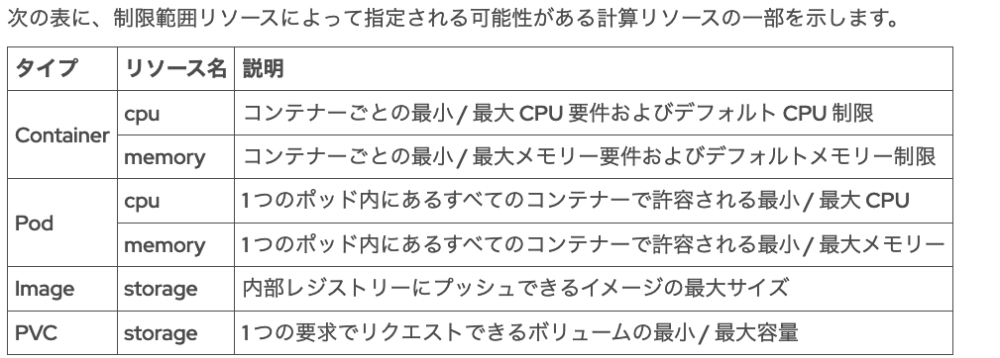
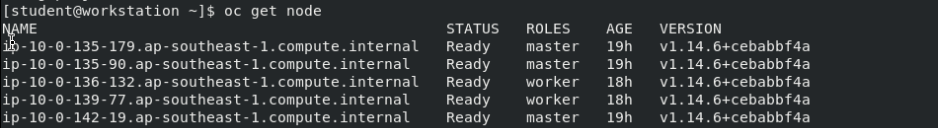
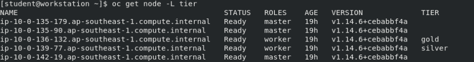

# 第6章 ポッドスケジューリングの制御

ポッドが実行されているノードを制御する。


## ポッドスケジューリングの動作の制御


### OpenShift スケジューラーアルゴリズムの概要

ポッドスケジューラーは、OpenShift クラスター内のノードへの新規ポッドの配置を決定します。

OpenShift のポッドスケジューラーアルゴリズムは、次の 3 ステップのプロセスに従っています。 

1. ノードのフィルターリング

スケジューラーは、ホストポートの可用性や、ポッドをディスクまたはメモリーの負荷が発生しているノードにスケジューリングできるかどうかなど、一連の述語に対して各ノードを評価することで、実行中のノードのリストをフィルタリングします。 

さらに、ポッドはクラスターノード内のラベルと一致するノードセレクターを定義することができます。ラベルが一致しないノードは対象外です。 

別のフィルタリングチェックでは、ノードのリストにテイントがあるかどうか、テイントがある場合はそのテイントを受け入れられる関連の耐性がポッドにあるかどうかが評価されます。
ポッドがノードのテイントを受け入れることができない場合、そのノードは適格ではありません。デフォルトでは、マスターノードにテイント node-role.kubernetes.io/master:NoSchedule が含まれています。このテイントに合った耐性がないポッドは、マスターノードにスケジュールされません。

- [taint(テイント)とToleration](https://kubernetes.io/ja/docs/concepts/scheduling-eviction/taint-and-toleration/)
```
taintはnodeが持ち、tolerationはpodが持つ。nodeとpod同士が相性がいいか評価。

taintはNodeがある種のPodを排除できるようにします。(そのNodeが持つtaintの条件に合わないpodは受け入れられない)
toleration はPodに適用され、一致するtaintが付与されたNodeへPodがスケジューリングされることを認めるものです。ただしそのNodeへ必ずスケジューリングされるとは限りません。
taintとtolerationは組になって機能し、Podが不適切なNodeへスケジューリングされないことを保証します。taintはNodeに一つまたは複数個付与することができます。
```

**フィルタリングステップの最終結果は通常、ポッドの実行に適したノード候補を絞り込んだリストです。**


2. フィルタリングされたノードのリストの優先順位付け

候補となるノードのリストは、重み付けスコアになる複数の優先順位基準を使用して評価されます。値の大きいノードは、ポッドの実行により適した候補になります。 

評価基準には、アフィニティルールと非アフィニティルールがあります。

アフィニティルールは一般的に、パフォーマンス上の理由から、関連するポッドを互いに近接してスケジュールするために使用されます。
たとえば、互いに同期を保つポッドに対して同じネットワークバックボーンを使用する場合があります。

非アフィニティルールは一般的に、高可用性を保つために関連するポッドを互いに近接しないようにスケジュールするために使用されます。
例として、同じアプリケーションからのすべてのポッドを同じノードにスケジュールしないようにすることが挙げられます。 


3. 最適なノードの選択

候補リストはスコアに基づいて分類され、最高スコアのノードがポッドのホストとして選択されます。

複数のノードが同じハイスコアを獲得した場合、その中の 1 つがラウンドロビン方式で選択されます。


### スケジューリングとトポロジー

クラウドプロバイダーなどの大規模なデータセンターでの一般的なトポロジーでは、ホストをリージョンおよびゾーンに編成します。

リージョンは地理的に近接するホストのセットであり、各ホスト間では高速な接続が保証されます。

ゾーンはアベイラビリティゾーンとも呼ばれるホストのセットで、ネットワークスイッチ、ストレージアレイ、無停電電源装置 (UPS) などの一般的な重要インフラストラクチャコンポーネントを共有しているため、同時に障害が発生する可能性があります。 

[Network topology](https://en.wikipedia.org/wiki/Network_topology)


### ノードのラベル付け

OpenShift クラスター管理者として、ノードにラベルを追加することができます。

たとえば、開発、品質保証、および実稼働ワークロードを特定のノードのサブセットにデプロイする目的で、dev、qa、または prod の値を使ってノードに env ラベルを付けることができます。任意のラベルを選択できますが、ラベルとそれに関連付けられた値を開発者に公開して、アプリケーションを適切に設定できるようにする必要があります。 

ノードラベルを即座に追加、更新、または削除するには、クラスター管理者として **oc label** コマンドを使用

- ノード:node1.us-west-1.compute.internalに env=dev のラベルを付けます。 

> oc label node node1.us-west-1.compute.internal env=dev(devという値を使ったenvラベル)

- 既存のラベルを変更する。

> oc label node node1.us-west-1.compute.internal env=prod **--overwrite**

- ラベルの削除。env- のようにラベル名の後にハイフンを指定。

> oc label node node1.us-west-1.compute.internal **env-**

- oc get nodes コマンドで --show-labels オプションを使用すると、ノードに割り当てられている大文字と小文字が区別されたラベルを確認できる、。

> oc get node node2.us-west-1.compute.internal **--show-labels**


ノードには OpenShift によって複数のデフォルトラベルが割り当てられている場合があります。
**キーに kubernetes.io サフィックスが含まれているラベルは、スケジューラーによって内部的に使用されるため、クラスター管理者が変更することはできません。**


- クラスター管理者は -L オプションを使用して、1 つのラベルの値を確認できる。

> oc get node -L failure-domain.beta.kubernetes.io/region

- 複数も可能

> oc get node -L failure-domain.beta.kubernetes.io/region -L failure-domain.beta.kubernetes.io/zone -L env


### マシンセットのラベル付け

ノードラベルは永続的ですが、OpenShift クラスターにマシンセット (クラスターがフルスタック自動化メソッドを使用してインストールされた場合に作成される) が含まれている場合は、マシンセット設定にもラベルを追加する必要があります。これにより、新しいマシン (およびそこから生成されるノード) にも目的のラベルが含まれるようになります。 

- openshift-machine-api 名前空間内のマシンを一覧表示して -o wide オプションを含めることで、マシンとノードの関係を特定できます。 

> oc get machines -n openshift-machine-api -o wide

- worker ノードに使用されるマシンは、マシンセットから生成される必要があります。マシン名には、生成元のマシンセットの名前が含まれています

> oc get machineset -n openshift-machine-api

- マシンセットを編集して、そこから生成された新しいマシンに目的のラベルが付くようにします。**マシンセットを変更しても、既存のマシンやノードに変更が適用されることはありません。**

> oc edit machineset ocp-qz7hf-worker-us-west-1b -n openshift-machine-api


### ポッド配置の制御

OpenShift クラスターに含まれる多くのインフラストラクチャ関連ポッドは、マスターノード上で実行されるように設定されています。

たとえば、DNS オペレーター、OAuth オペレーター、および OpenShift API サーバーのポッドがこれに該当します。場合によっては、デーモンセットまたはレプリカセットの設定でノードセレクター node-role.kubernetes.io/master: '' を使用して設定されます。

同様に、一部のユーザーアプリケーションは特定のノードセット上で動作させる必要がある場合があります。

たとえば、ある種のワークロードに対するハードウェアアクセラレーターを実装しているノードがある場合や、クラスター管理者が本番アプリケーションを開発アプリケーションと混在させたくない場合などがあります。このようなシナリオを実装するには、ノードラベルおよびノードセレクターを使用します。 


**ノードセレクター**は、個々のポッド定義の一部です。
デプロイまたはデプロイ設定リソースのいずれかでノードセレクターを定義し、そのリソースから生成される新しいポッドに必要なノードセレクターが含まれるようにします。デプロイまたはデプロイ設定リソースがバージョン管理されている場合は、リソースファイルを変更し、oc apply -f コマンドを使用して変更を適用します。

また、oc edit コマンドまたは oc patch コマンドを使用して、ノードセレクターを追加または変更できます。

- myapp デプロイのポッドが env=qa ラベルのノード上でのみ動作するように設定するには、次のように oc edit コマンドを使用します。 

> oc edit deployment/myapp
```
...output omitted...
  template:
    metadata:
      creationTimestamp: null
      labels:
        app: myapp
    spec:
      nodeSelector:
        env: dev
      containers:
      - image: quay.io/redhattraining/scaling:v1.0
...output omitted...
```

- oc patch コマンドでもoc editコマンドと同じ結果を得られます。

> oc patch deployment/myapp --patch '{"spec":{"template":{"spec":{"nodeSelector":{"env":"dev"}}}}}'


### プロジェクトのノードセレクターの設定

開発者が各自のポッドでノードセレクターを制御できないようにする場合、クラスター管理者はプロジェクトリソースにデフォルトのノードセレクターを設定する必要があります。
クラスター管理者は、プロジェクトの作成時にノードセレクターを定義するか、プロジェクトの作成後にノードセレクターを追加または更新できます。

1. プロジェクトの作成時にノードセレクターを追加する場合

例) demo という名前の新しいプロジェクトが作成されます。このプロジェクトでは、tier=1 のラベルを持つノードにすべてのポッドがデプロイされます。

> oc adm new-project demo --node-selector "tier=1"

2. 既存のプロジェクトにデフォルトノードセレクターを設定する場合

openshift.io/node-selector キーを持つ名前空間リソースにアノテーションを追加します。oc annotate コマンドを使用して、ノードセレクターのアノテーションを追加、変更、または削除できます。 

> oc annotate namespace demo openshift.io/node-selector="tier=2" --overwrite


### ポッドレプリカ数のスケーリング

- myapp デプロイのポッド数を 3 に拡張できます。 

> oc scale --replicas 3 deployment/myapp


### ガイド付き演習: ポッドスケジューリングの動作の制御

- quay.io/redhattraining/hello-world-nginx:v1.0 にあるコンテナーを使用して、hello という名前の新しいアプリケーションを作成します。

> oc create deployment hello --image quay.io/redhattraining/hello-world-nginx:v1.0

- 上記をサービスとして開始

> oc expose deployment/hello --port 80 --target-port 8080

- 外部に公開

> oc expose service hello

- 実行中のポッドが 4 つになるように、アプリケーションを**手動**でスケーリングします。 

> oc scale --replicas 4 deployment/hello


---

## リソース使用の制限

制限範囲とリソースクォータを使用してアプリケーションのリソース消費を制限できるようになります。 


### リソースリクエストとポッドの制限の定義

ポッドの定義

- リソースリクエスト

スケジューリングに使用され、規定量未満の計算リソースではポッドを実行できないことを示します。スケジューラーは、ポッドのリクエストを満たす十分な計算リソースを持つノードの検出を試みます。 

- リソース制限

ポッドがノードのすべての計算リソースを使い尽くさないようにするために使用されます。ポッドを実行するノードは、Linux カーネルの cgroups 機能を設定してポッドのリソース制限を実行します。 


- 定義方法

1. **デプロイまたはデプロイ設定リソースのコンテナーごと**に定義する必要があります。リクエストと制限が定義されていない場合は、各コンテナーに resources: {} 行が表示されます。
```
...output omitted...
    spec:
      containers:
      - image: quay.io/redhattraining/hello-world-nginx:v1.0
        name: hello-world-nginx
        resources:
          requests:
            cpu: "10m"
            memory: 20Mi
          limits:
            cpu: "80m"
            memory: 100Mi
status: {}
```

2. oc editコマンドで

> oc set resources deployment hello-world-nginx --requests cpu=10m,memory=20Mi --limits cpu=80m,memory=100Mi


### リクエスト、制限、実際の使用量の表示

- ノード：node1.us-west-1.compute.internalの計算使用情報を表示

> oc describe node node1.us-west-1.compute.internal
```
[user@demo ~]$ oc describe node node1.us-west-1.compute.internal
Name:               node1.us-west-1.compute.internal
Roles:              worker
Labels:             beta.kubernetes.io/arch=amd64
                    beta.kubernetes.io/instance-type=m4.xlarge
                    beta.kubernetes.io/os=linux
...output omitted...
Non-terminated Pods:                      (20 in total)
...  Name                CPU Requests  ...  Memory Requests  Memory Limits  AGE
...  ----                ------------  ...  ---------------  -------------  ---
...  tuned-vdwt4         10m (0%)      ...  50Mi (0%)        0 (0%)         8d
...  dns-default-2rpwf   110m (3%)     ...  70Mi (0%)        512Mi (3%)     8d
...  node-ca-6xwmn       10m (0%)      ...  10Mi (0%)        0 (0%)         8d
...output omitted...
  Resource                    Requests     Limits
  --------                    --------     ------
  cpu                         600m (17%)   0 (0%)
  memory                      1506Mi (9%)  512Mi (3%)
...output omitted...
```

- oc adm top コマンドは**実際の使用量**を表示
    - kubernetes.ioサフィックスが付いているものは内部的に使われ、弄れない。

> oc adm top nodes -l node-role.kubernetes.io/worker


### クォータの適用

OpenShift Container Platform は、2 種類のリソースの使用を追跡および制限するクォータを実行できます。

1. オブジェクトカウント

Kubernetes リソース (ポッド、サービス、ルートなど) の数。 

2. 計算リソース

物理または仮想ハードウェアリソース (CPU、メモリー、ストレージ容量など) の数。 


Kubernetes リソースの数にクォータを適用して、Etcd データベースの無制限の増大を阻止することで、OpenShift コントロールプレーンの安定性が向上します。

Kubernetes リソースにクォータを使用すると、制限のある他のソフトウェアリソース (サービスの IP アドレスなど) の消耗も防ぐことができます。 


- etcd
    - 参照: [Kubernetesのコンポーネント](https://kubernetes.io/ja/docs/concepts/overview/components/)
```
etcd
一貫性、高可用性を持ったキーバリューストアで、Kubernetesの全てのクラスター情報の保存場所として利用されています。
etcdをKubernetesのデータストアとして使用する場合、必ずデータのバックアッププランを作成して下さい。
```

クォータ属性は、プロジェクトにあるすべてのポッドのリソースリクエストまたはリソース制限を追跡できます。デフォルトでは、クォータ属性はリソースリクエストを追跡します。
リソース制限を追跡するときは、計算リソースの名前に limits.cpu のように**接頭辞 limits**を付けます。 


- YAML 構文を使用して定義された ResourceQuota リソース
```
apiVersion: v1
kind: ResourceQuota
metadata:
  name: dev-quota
spec:
  hard:
    services: "10"
    cpu: "1300m"
    memory: "1.5Gi"
```

- 上記のResourceQuoteのYAML構文を用いて、クォータを作成。

> oc create --save-config -f dev-quota.yml 

- クォータを作成する別の方法は、次のように oc create quota コマンドを使用。

> oc create quota dev-quota --hard services=10,cpu=1300,memory=1.5Gi

- oc describe quota コマンドを使用すると、プロジェクト内のすべての ResourceQuota リソースに対して設定された累積制限数が表示されます。

- oc delete コマンドによる削除

> oc delete resourcequota QUOTA


### 制限の範囲の適用

LimitRange リソースは limit とも呼ばれ、プロジェクト内で定義された 1 つのポッドまたは 1 つのコンテナーに対して、計算リソースのリクエストおよび制限のデフォルト値、最小値、最大値を定義します。

制限範囲リソースでは、イメージ、イメージストリーム、または永続ボリューム要求によってリクエストされるストレージ容量のデフォルト値、最小値、最大値を定義することもできます。

**上記のクォータの違いを理解するために、制限範囲は 1 つのポッドの有効な範囲とデフォルト値を定義し、リソースクォータはプロジェクト内の全ポッドの最大合計値のみを定義することを考慮してください。**




- 制限範囲の作成は、以下のようなYAML または JSON リソースの定義ファイルを oc create コマンドに渡すことによって作成します。 

> dev-limits.yml
```
apiVersion: "v1"
kind: "LimitRange"
metadata:
  name: "dev-limits"
spec:
  limits:
    - type: "Pod"
      max:
        cpu: "500m"
        memory: "750Mi"
      min:
        cpu: "10m"
        memory: "5Mi"
    - type: "Container"
      default:
        cpu: "100m"
        memory: "100Mi"
      max:
        cpu: "500m"
        memory: "750Mi"
      min:
        cpu: "10m"
        memory: "5Mi"
```

> oc create --save-config -f dev-limits.yml

- プロジェクトに適用されている制限を表示

> oc describe limitrange dev-limits

- アクティブな制限範囲の削除

> oc delete limitrange dev-limits


### 複数のプロジェクトへのクォータの適用

ClusterResourceQuota リソースは、永続ボリュームと同様の方法でクラスターレベルで作成され、複数のプロジェクトに適用されるリソースの制約を指定します。

クラスター管理者は、次の 2 つの方法でクラスターリソースクォータの対象となるプロジェクトを指定できる。

1. openshift.io/requester のアノテーションを使ってプロジェクトオーナーを指定する。

2. セレクターを使用する。ラベルがセレクターと一致するすべてのプロジェクトが、クォータの対象となります。 


- qa ユーザーが所有する全プロジェクトのためのクラスターリソースクォータの作成例

> oc create clusterquota user-qa --project-annotation-selector openshift.io/requester=qa --hard pods=12,secrets=20

- environment=qa ラベルが割り当てられた全プロジェクトのためのクラスターリソースクォータの作成例

> oc create clusterquota env-qa --project-label-selector environment=qa --hard pods=10,services=5


### 演習

- デプロイリソースファイルを作成し、~/DO280/labs/schedule-limit/hello-limit.yaml に保存します。

> **oc create deployment hello-limit --image quay.io/redhattraining/hello-world-nginx:v1.0 --dry-run -o yaml > ~/DO280/labs/schedule-limit/hello-limit.yaml**

- 編集したリソースファイルを使用して、新しいアプリケーションを作成します。 

> oc create --save-config -f ~/DO280/labs/schedule-limit/hello-limit.yaml

- アプリケーションに変更を適用

> oc apply -f ~/DO280/labs/schedule-limit/hello-limit.yaml

- TYPE=Warinigのイベントを確認できる

> oc get events --field-selector type=Warning

- hello-limit アプリケーションに関連付けられているすべてのリソースを削除します。

> oc delete all -l app=hello-limit

- schedule-limit プロジェクトを 3 つの CPU、1GB のメモリー、3 つの設定マップに制限する project-quota というクォータを作成

> oc create quota project-quota --hard cpu="3",memory="1G",configmaps="3" -n schedule-limit(project名)

- project-quota クォータを削除

> oc delete resourcequota project-quota


---

## アプリケーションのスケーリング

### 設定ワークロードでのポッドレプリカの指定

特定のデプロイまたはデプロイ設定のポッドレプリカの数をニーズに合わせて増減させることができます。

ReplicaSet および ReplicationController リソースにかかわらず、アプリケーションに必要なレプリカの数は**通常、デプロイまたはデプロイ設定リソースで定義されています。**

レプリカセットまたはレプリケーションコントローラー (デプロイまたはデプロイ設定で管理される) は、ポッドの指定された数のレプリカが常に実行されるよう保証します。レプリカセットまたはレプリケーションコントローラーは、必要に応じてポッドを追加または削除して、目的のレプリカ数に一致させることができます。 


次のデプロイリソース (oc create deployment コマンドを使用して作成) には、以下の項目が表示されます。 
```
apiVersion: apps/v1
kind: Deployment
...output omitted...
spec:
  replicas: 1         ...(1) レプリカ数
  selector:
    matchLabels:
      app: scale      ...(2)　
  strategy: {}
  template:           ...(3)
    metadata:
      labels:
        app: scale    ...(4)
    spec:
      containers:
...output omitted...
```

一般的に oc new-app コマンドまたは Web コンソールを使用して作成されたデプロイ設定は、同じ情報を定義しますが、方法が若干異なります。
```
apiVersion: apps.openshift.io/v1
kind: DeploymentConfig
...output omitted...
spec:
  replicas: 1
  selector:
    app: hello
    deploymentconfig: hello
  strategy:
    resources: {}
  template:
    metadata:
      annotations:
        openshift.io/generated-by: OpenShiftNewApp
      labels:
        app: hello
        deploymentconfig: hello
...output omitted...
```


### ポッドレプリカ数の手動スケーリング

開発者と管理者は、プロジェクト内のポッドレプリカの数を手動でスケーリングすることを選択できます。
予想されるトラフィックの急増に備えて多くのポッドが必要になったり、ポッド数が減少してクラスターの他の場所で使用可能なリソースを解放したりする場合があります。

ポッドのレプリカ数を増やす場合も減らす場合も、最初の手順は、スケーリングする適切なデプロイまたはデプロイ設定 (dc) を oc get コマンドを使用して特定することです。

- deployment/scaleのレプリカ数を手動で増やす

> oc scale --replicas 5 deployment/scale


### ポッドの自動スケーリング

OpenShift ではアプリケーションポッドの現在の負荷に基づいて、**HorizontalPodAutoscaler リソースタイプ**を使用してデプロイまたはデプロイ設定を自動スケーリングすることができます。 

- 水平ポッド自動スケーラーリソースを作成するには、次の例のように oc autoscale コマンドを使用する方法をお勧めします。 dc(new-appしたやつ？)もしくはdeployment指定

> oc autoscale dc/hello --min 1 --max 10 --cpu-percent 80

- loadtest アプリケーションで常に 2 つのアプリケーションポッドが実行されるようにします。この数は、CPU の負荷が 50% を超えたときに最大で 10 ポッドまで増えます。

> oc autoscale deployment/loadtest --min 2 --max 10 --cpu-percent 50

hello デプロイ設定のレプリカの数を変更し、要求された CPU 合計使用量の 80% 未満にポッドを保ちます。 

- 現在のプロジェクトの水平ポッド自動スケーラーリソースに関する情報を取得する

> oc get hpa
```
[user@demo ~]$ oc get hpa
NAME   REFERENCE               TARGETS        MINPODS  MAXPODS  REPLICAS  ...
hello  DeploymentConfig/hello  <unknown>/80%  1        10       1         ...
scale  Deployment/scale        60%/80%        2        10       2         ...
```

> 特定のtargetm指定できる。
```
[user@demo ~]$ oc get hpa/loadtest
NAME      REFERENCE            TARGETS    MINPODS  MAXPODS  REPLICAS  ...
loadtest  Deployment/loadtest  172%/50%   2        10       9         ...
```

### 演習


---

### review

- CPU およびメモリー使用量のリクエストと制限の両方を設定するように、~/DO280/labs/schedule-scale/loadtest.yaml にあるリソースファイルを変更します。

> vimして、resources: {} 行を書き換える。
```
...output omitted...
    spec:
      containers:
      - image: quay.io/redhattraining/loadtest:v1.0
        name: loadtest
        resources:
          requests:
            cpu: "25m"
            memory: 25Mi
          limits:
            cpu: "100m"
            memory: 100Mi
status: {}
```

- リソースファイルを使用して、新しいアプリケーションを作成

> oc create --save-config -f ~/DO280/labs/schedule-scale/loadtest.yaml

- scaling アプリケーションの 3 つのポッドがすべて実行されていることを確認し、関連付けられている IP アドレスを特定

> oc get pods **-o wide** -l app=scaling


## REVIEW

- 2 つのワーカーノードに tier ラベルを付けます。一方のワーカーノードに tier=gold ラベル、もう一方のワーカーノードに tier=silver ラベルを付けます。 

> oc get pod -o wide -> workerがどれか判別できる



> oc label node xxx tier=gold
> oc label node xxx tier=silver

- labelの確認

> oc get nodes -l node-role.kubernetes.io/worker -L tier



```
-L , --Label-columns : 出力したいlabelを指定する。
```

---

- quay.io/redhattraining/loadtest:v1.0 にあるコンテナーイメージを使用して、loadtest という名前の新しいアプリケーションを作成します。

loadtest アプリケーションは、tier=silver ラベルが付いているノードにデプロイする必要があります。各コンテナーが 100m の CPU と 20Mi のメモリーをリクエストしていることを確認します。

-> **調整を容易にするために、実際にアプリケーションを作成することなく、デプロイリソースファイルを作成**

> oc create deployment loadtest **--dry-run** --image quay.io/redhattraining/loadtest:v1.0 **-o yaml** > ~/DO280/labs/schedule-review/loadtest.yaml

```
--dry-run : 送信されるであろうオブジェクトを送信せず、出力するだけ？
-o , --output 
```

- アプリケーションの作成方法によっては、ルートを作成する前にサービスを作成する必要があります。
  - 今回は、yamlファルの中でexpose設定がされたいなかったため

> oc expose deployment/loadtest --port 80 --target-port 8080


---

- リソースクォータを作成

> oc create quota review-quota --hard cpu="1",memory="2G",pods="20"

```
--hard : ハードリミット(上限値)を定義する、カンマ区切りで
```

