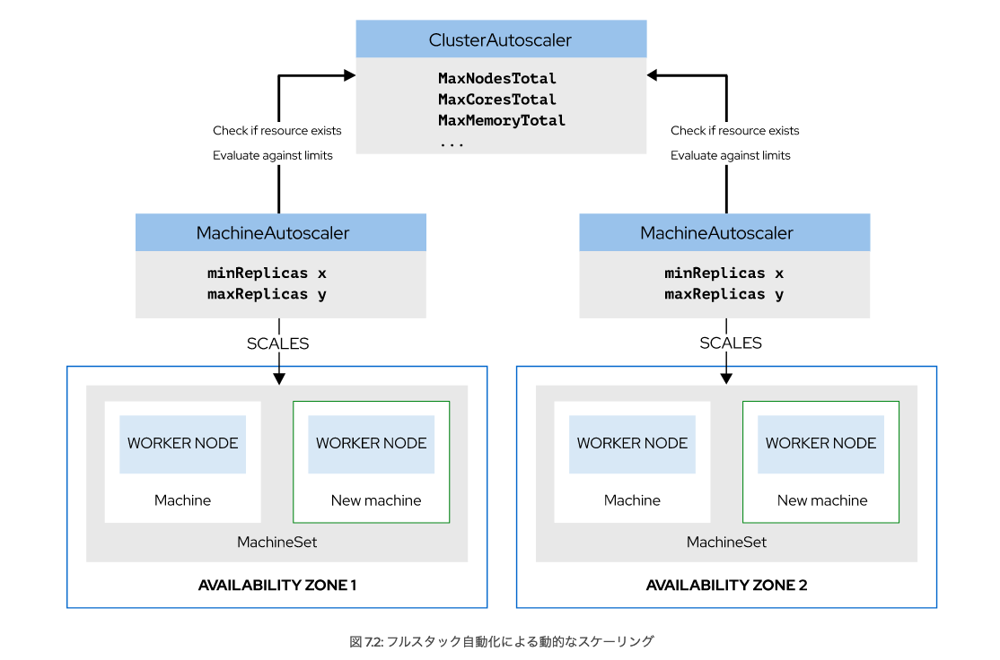

# 第7章 OpenShift クラスターのスケーリング

## OpenShift クラスターの手動スケーリング

コマンドを発行して**クラスター内のワーカーの数**を制御できるようになります。 

### Machine API の概要

Machine API を使用してワーカーを追加または削除することで、クラスターをスケールインおよびスケールアウトできます。

スケーリング機能により、クラスターはアプリケーションに十分な計算能力を提供できます。スケーリングプロセスは、必要に応じて手動または自動で実行できる。

Machine API は次のカスタムリソースを提供します。 

- Machine はクラスター内の基本的な計算ユニットです。各 Machine リソースは、物理または仮想ノードに関連しています。

```
apiVersion: machine.openshift.io/v1beta1
kind: Machine
metadata:
  generateName: ocp-demo-xxyy-worker-us-west-2b-
  name: ocp-demo-xxyy-worker-us-west-2b-rcm72
  uid: 9e4e1744-0d42-11ea-9a46-025ef26e9de6
  ...
  labels:
    machine.openshift.io/cluster-api-machine-type: worker
    ...
    machine.openshift.io/instance-type: m4.xlarge
    machine.openshift.io/region: us-west-2
    machine.openshift.io/zone: us-west-2b
spec:
  providerID: 'aws:///us-west-2b/i-0c537ed8c82ea894d'
  providerSpec:
    value:
    ...
      placement:
        availabilityZone: us-west-2b
        region: us-west-2
      credentialsSecret:
        name: aws-cloud-credentials
      instanceType: m4.xlarge
      blockDevices:
        - ebs:
            iops: 0
            volumeSize: 120
            volumeType: gp2
      securityGroups:
        - filters:
            - name: 'tag:Name'
              values:
                - ocp-demo-xxyy-worker-sg
      deviceIndex: 0
      ami:
        id: ami-08e10b201e19fd5e7
```


- MachineSet はホストのグループを記述します。

**MachineSet はマシンにとって、ポッドに対する ReplicaSet と同じです。このリソースによって指定されたレプリカ (マシン) の数をスケールインおよびスケールアウトできます。**

```
apiVersion: machine.openshift.io/v1beta1
kind: MachineSet
metadata:
  name: ocp-demo-xxyy-worker-us-west-2b
...
spec:
  replicas: 1
  selector:
    matchLabels:
      machine.openshift.io/cluster-api-cluster: ocp-demo-rnh2q
      machine.openshift.io/cluster-api-machineset: ocp-demo-xxyy-worker-us-west-2b
  template:
    metadata:
      creationTimestamp: null
      labels:
        machine.openshift.io/cluster-api-cluster: ocp-demo-xxyy
        machine.openshift.io/cluster-api-machine-role: worker
        machine.openshift.io/cluster-api-machine-type: worker
        machine.openshift.io/cluster-api-machineset: ocp-demo-xxyy-worker-us-west-2b
    spec:
      metadata:
        creationTimestamp: null
      providerSpec:
      ...
          placement:
            availabilityZone: us-west-2b
            region: us-west-2
          credentialsSecret:
            name: aws-cloud-credentials
          instanceType: m4.xlarge
          metadata:
            creationTimestamp: null
          publicIp: null
 ...
```


- MachineAutoscaler と ClusterAutoscaler は、クラウドデプロイでリソースを自動的にスケーリングする際に使用します。

また、ワーカーノードが応答しなくなった場合に、自動スケーリングによってポッドが別のワーカーノードに迅速に退避されるため、可用性が向上します。
スケーリングは、クラスターに負荷がかかっている場合、またはコンピューティング要件が変化するワークロードの場合に役立ちます。

このリソースを使用すると、ノード、コア、メモリーなどのさまざまなコンポーネントをスケーリングできます。 

```
piVersion: "autoscaling.openshift.io/v1"
kind: "ClusterAutoscaler"
metadata:
  name: "default"
spec:
  resourceLimits:
    maxNodesTotal: 20
  scaleDown:
    enabled: true
    delayAfterAdd: 10s
    delayAfterDelete: 10s
    delayAfterFailure: 10s
```


### ワーカーノードの手動スケーリング

デプロイやデプロイ設定と同様に、MachineSet リソースによって指定されたレプリカを調整してインスタンスの数を変更します。

> oc scale --replicas=2 machineset MACHINE-SET -n openshift-machine-api


### 演習

- マシンセットを編集して、そこから作成された新しいマシン (および新しいマシンに関連付けられた新しいワーカーノード) にenv=prod ラベルが付くようにします。 

> oc edit machineset machineset名 -n openshift-machine-api

```
  template:
    metadata:
      creationTimestamp: null
      labels:
        machine.openshift.io/cluster-api-cluster: ocp-qz7hf
        machine.openshift.io/cluster-api-machine-role: worker
        machine.openshift.io/cluster-api-machine-type: worker
        machine.openshift.io/cluster-api-machineset: ocp-qz7hf-worker-us-west-1b
    spec:
      metadata:
        creationTimestamp: null
        labels:
          env: prod
...output omitted...
```

- 3 台のレプリカマシンを含むように、変更したマシンセットをスケーリングします

> oc scale machineset machineset名 --replicas 3 -n openshift-machine-api

- env=prod のラベルが付いたノードにポッドをデプロイする scale-manual というプロジェクトを作成
    - ノードセレクターとして env=prod を使用

> oc adm new-project scale-manual --node-selector env=prod


#### MEMO

**-n : namespace 名前空間**

---

## OpenShift クラスターの自動スケーリング

パラメーターを定義してクラスターのサイズを自動的に制御できるようになります。 

### クラスターの自動スケーリング

Machine API はクラスターのワークロードを管理するためのリソースを複数提供します。クラスターリソースは、手動と自動の 2 つの方法でスケーリングできます。 

クラスターの自動スケーリングでは、**MachineAutoscaler** と **ClusterAutoscaler** の 2 つのカスタムリソースが使用されます。 

- MachineAutoscaler 

リソース負荷に応じてマシンセット内のレプリカの数を自動的にスケーリングします。この API リソースはマシンセットとやり取りして、ワーカーノードをクラスターに追加するように指示します。

リソースは、下限と上限の定義をサポートしています。

MachineAutoscalerのスケーリングは ClusterAutoscaler を定義した場合にのみ機能し、新しいマシンを追加しても ClusterAutoscaler リソースで定義された値を超えることはありません。

- ClusterAutoscaler

ノードの合計数などの制限をクラスター全体に適用します。たとえば、MaxNodesTotal はクラスター全体の最大コア数を設定し、MaxMemoryTotal はクラスター全体の最大メモリーを設定します。

各 OpenShift クラスターで使用できる ClusterAutoscaler リソースは **1 つ**のみ

- 注記

**クラスターに ClusterAutoscaler リソースを定義しないと、自動スケーリングは機能しません。**

**ClusterAutoscaler リソースは、MachineAutoscaler によって作成できるリソースの最大数を制御する。これにより、クラスターが無制御のまま拡張されないようにすることができる。**

以下、ClusterAutoscalerの抜粋

```
apiVersion: "autoscaling.openshift.io/v1"
kind: "ClusterAutoscaler"
metadata:
  name: "default"
spec:
  podPriorityThreshold: -10
  resourceLimits:
    maxNodesTotal: 6
scaleDown:
    enabled: true
    delayAfterAdd: 3m
    unneededTime: 3m
```

### MachineAutoscaler リソースが、ワーカーノードをスケールインおよびスケールアウトするマシンセットとやり取りする仕組み



- スケーリングが必要な場合、MachineAutoscaler リソースは **ClusterAutoscaler リソースが存在するかどうかを確認します。存在しない場合はスケーリングが行われません。**

- ClusterAutoscaler リソースが存在する場合、MachineAutoscaler リソースは、新しいマシンの追加が ClusterAutoscaler で定義された制限に違反しているかどうかを評価します。

- リクエストが制限を超えていなければ、新しいマシンが作成されます。

- 新しいマシンの準備ができると、OpenShift は新しいノードとしてポッドをスケジュールします。 


### 自動スケーリングの実装

自動スケーリングを正常に実行するには、次のものが必要

1. フルスタック自動化でデプロイされたクラスター (ワーカーを追加または削除するときに、自動スケーリングがクラウドサービスとやり取りする必要があるため)。

2. ClusterAutoscaler リソース (インフラストラクチャでサポートされている場合)。さらに、ClusterAutoscaler リソースによってノードの最大数が制限され、コア、メモリー、GPU の最小値と最大値が定義されます。ClusterAutoscaler リソースの scaleDown セクションにある enabled: true エントリーは、使用されていないマシンの数をクラスターが自動的にスケールインすることを許可します。

3. 少なくとも 1 つの MachineAutoscaler リソース

各 MachineAutoscaler リソースは、特定のマシンセットの最小および最大レプリカ数を定義します。 


### 演習

**基本、yamlファイルなんだ(yamlファイルの用途の一つは、各種設定ファイルに使われる)**


---