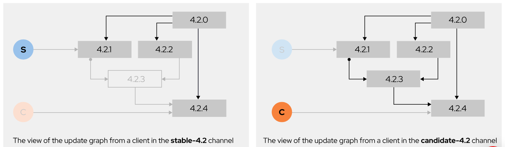

# 第8章 クラスターの更新の実行

## クラスターの更新プロセスの説明

クラスターの更新プロセスを説明できるようになります。 

### クラスターの更新の概要

Red Hat は新しいソフトウェア配布システムをリリースしました。これにより、クラスターおよび基盤となるオペレーティングシステムを更新するための最適なアップグレードパスが提供されます。

この新しい配布システムは、OpenShift 4 のアーキテクチャに関する変更における重要な利点の 1 つであり、クラスターを **OTA (Over-the-Air) でアップグレード**することが可能になります。 

- OTA

OTA 用のソフトウェア配布システムは、コントローラーマニフェスト、クラスターロール、および特定のバージョンにクラスターを更新するために必要なその他のリソースを管理します。

この機能により、クラスターで利用可能な最新バージョンがシームレスに実行されます。
また、最新のバグ修正やセキュリティパッチを含む新機能が使用可能になると、OTA によってこれらがクラスターで利用できるようになります。OTA はアップグレードによるダウンタイムを大幅に短縮します。 

OTA は中間バージョンのスキップを許可することで、更新の高速化を可能にします。たとえば、4.2.2 をバイパスして 4.2.1 から 4.2.3 に更新することができます。 

アップグレードパスは、アップグレードチャンネルに属します。**チャンネルは、アップグレードパスを表して視覚化できます。** チャンネルは更新の頻度と安定性を制御します。

**チャンネル名は、層 (candidate、fast、stable)、メジャーバージョン (4)、マイナーバージョン (.2) の 3 つの部分で構成されています。たとえば、candidate-4.2、fast-4.2、stable-4.2 などのチャンネル名があります。** 
各チャンネルは、特定のクラスターバージョンのパッチ (**z-stream 更新**とも呼ばれる) を配信します。 

- candidateチャネル(リリース候補チャネル)
    - リリース候補チャンネルを使用すると、クラスターは利用可能な最新の更新バージョンだけでなく、必要に応じて中間バージョンをインストールすることもできます。 
    - イメージは下記の右図
        - このチャンネルを使用すると、4.2.1、4.2.2、4.2.3 など、すべての z-stream リリースにアップグレードできます。 
    - リリースされたときに製品の最新機能にアクセスするには、このチャンネルを使用します。このチャンネルは、開発環境と試作環境に最適です。
    - candidate チャンネル (リリース候補チャンネル) は Red Hat では**サポートされません。**

- fastチャネル
    - fast チャンネルでは、更新が利用可能になるとすぐに配信されます。このチャンネルは、試作環境と QA 環境に最適です。 
    - fastチャンネルは、一般公開 (GA) として分類されます。

- stableチャネル
    - イメージは下記の左図
        - クラスターを 4.2.1 と 4.2.2 にアップグレードできるようになります。ただし、**4.2.3 リリースで問題が発見された場合、このチャンネルにアップグレードすることはできません。** 後で、4.2.4 リリースでパッチが利用可能になった場合、そのバージョンにクラスターを更新することができます。 
    - このチャンネルは、Red Hat SRE とサポートサービスによってそのチャンネルのリリースがテストされるため、実稼働環境に適しています。 
    - stableチャンネルは、一般公開 (GA) として分類されます。

- fastチャネルとstableチャネル
    - stable チャンネルには遅延更新が含まれています。
        - Red Hat のサポートチームおよびサイト信頼性エンジニアリング (SRE) チームは、新しい fast 更新が含まれる運用クラスターを監視します。運用クラスターが追加のテストと検証に合格した場合、fast チャンネルの更新が stable チャンネルで有効になります。
        - **Red Hat が fast チャンネルの更新で運用上の問題を確認した場合、その更新は stable チャンネルでスキップされます**。stable チャンネルの遅延により、テストでは判明しなかった、実際の OpenShift クラスターでの予期しない問題を確認する時間が得られます。 




クラスターの安定性と適切なサポートを確保するために、stable チャンネルまたは fast チャンネルから candidate チャンネルに切り替えることはできません。ただし、stable チャンネルから fast チャンネルに切り替えることはできます (逆も同様)。 


### OTA について

OTA は、クライアント/サーバーアプローチに従います。Red Hat は、クラスターイメージと更新インフラストラクチャをホストしています。

OTA の 1 つの特徴は、クラスターのすべてのアップグレードパスを生成することです。OTA はクラスターとエンタイトルメントに関する情報を収集して、利用可能なアップグレードパスを特定します。

新しい更新が利用可能になると、Web コンソールを介して通知されます。 

Telemetry によって、Red Hat はアップグレードパスを特定できます。
クラスターは Prometheus ベースの Telemetry を使用して、各クラスターオペレーターの状態を報告します。データは匿名化されて Red Hat サーバーに戻され、新しいリリースの可能性についてクラスター管理者に提案されます。 


### 更新プロセスについて

- Machine Config オペレーター

Machine Config オペレーターは、該当するマシンの状態を各ノードに適用します。また、このコンポーネントはクラスター内のノードのローリングアップグレードを処理し、設定形式として CoreOS Ignition を使用します。 


- Operator Lifecycle Manager (OLM)

Operator Lifecycle Manager (OLM) は、クラスター内で実行されているオペレーターに対する更新のオーケストレーションを行います。 


### クラスターの更新

クラスターは、Web コンソールまたはコマンドラインを使用して更新できます。

#### webコンソールの場合

コマンドラインを使用した更新よりも簡単です。新しい更新が利用可能になると、クラスター管理ページが表示されます。[Update now] をクリックしてプロセスを実行します。

#### コマンドラインの場合の手順

- クラスターバージョンを取得

> oc get clusterversion

- 現在の更新チャンネル情報でチャンネルを確認します。クラスターを実稼働環境で実行している場合は、チャンネルが stable であることを確認します。 

> oc get clusterversion -o json|jq ".items[0].spec"

- 利用可能な更新を表示し、適用する更新のバージョン番号を書き留めます。 

> oc adm upgrade

ex) 出力イメージ
```
[user@demo ~]$ oc adm upgrade
Cluster version is 4.2.2

Updates:

VERSION IMAGE
4.2.4   quay.io/openshift-release-dev/ocp-release@sha256:...
4.2.7   quay.io/openshift-release-dev/ocp-release@sha256:...
4.2.8   quay.io/openshift-release-dev/ocp-release@sha256:...
4.2.9   quay.io/openshift-release-dev/ocp-release@sha256:...
4.2.10  quay.io/openshift-release-dev/ocp-release@sha256:...
4.2.12  quay.io/openshift-release-dev/ocp-release@sha256:...
4.2.13  quay.io/openshift-release-dev/ocp-release@sha256:...
```

- クラスターで使用可能な**最新の更新**をインストール

> oc adm upgrade --to-latest=true

- 特定のバージョンをインストール

> oc adm upgrade --to=VERSION(特定のバージョン名)

- 上記コマンドによって更新プロセスが初期化されます。以下コマンドを実行して、Cluster Version Operator (CVO) のステータスを確認します。
    - version キーが、選択したバージョンと一致します。 

> oc get clusterversion -o json|jq ".items[0].spec"

- クラスターバージョンのステータス履歴を確認し、更新のステータスを監視できます。
    - すべてのオブジェクトの更新が完了するまでには、しばらく時間がかかる場合があります。 

> oc get clusterversion -o json|jq ".items[0].status.history"

- 更新が完了したら、クラスターバージョンが新しいバージョンに更新されたことを確認

> oc get clusterversion