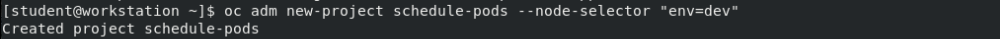
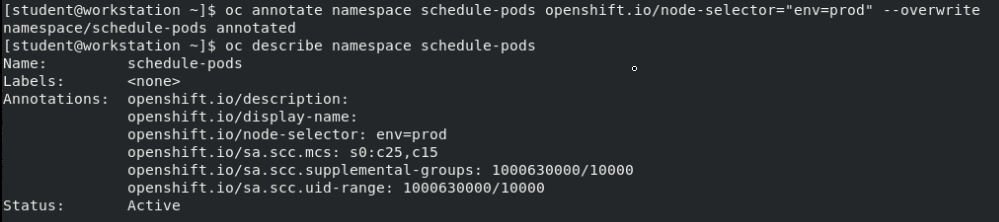

">" これは間違ったやつ

## 第3章

### OAuthの編集

$ oc get oauth **cluster** -o yaml > oauth.yaml

oauthの名前は、clusterか

> OAuth変更
```
spec: 
  identityProviders: 
  - name: myuser
    mappingMethod: claim
    type: HTPasswd
    htpasswd:
      fileData:
        name: myuser-secret
```

$ oc replace -f oauth.yaml

### HTPasswdファイルの作成

htpasswdでのsecretで使用するnamespaceはopenshift-config(oauthとの兼ね合い)

#### 新規

$ htpasswd -c -b ~/htpasswd tokutake Yasunari8930

~~$ oc create secret generic htpasswd-secret --from-file=~/htpasswd~~

> $ oc create secret generic htpasswd-secret --from-file **htpasswd**=~/htpasswd -n **openshift-config**

作成したseretをoauthに組み込む


#### 既存

$ oc extract secret/htpasswd-secret -n openshift-config --to=~/ --confirm

> $ oc set data secret/htpasswd-secret -n openshift-config --from-file htpasswd=~/htpasswd


### 削除

$ htpasswd -D ~/htpasswd tokutake Yasunari8930

$ oc set data secret/htpasswd-secret -n openshift-config --from-file htpasswd=~/htpasswd

$ oc delete user tokutake

$ oc delete identity myuser:tokutake


### 管理者権限を与える

$ oc adm policy add-cluster-role-to-user cluster-admin student


## 第4章

role、clusterroleは影響範囲を表す

ユーザーやグループに付加されているroleの確認

$ oc get rolebindings -o wide

$ oc get clusterrolebindings -o wide | grep self-provisioner

### secret

namespace 内で共有可能

$ oc create secret generic test -from-literal keys=xxxx --from-literal=yyyy

Pod のサービスアカウントを更新して、シークレットへの参照を許可します。

$ oc secrets add --for mount sa/test secret/test

- podへの環境変数

1. 
```
env:
  - name: MYSQL_ROOT_PASSWORD 
    valueFrom:
      secretKeyRef:
        name: demo-secret 
        key: root_password 
```

2. 

$ oc set env deployment/test --from=secret/test --prefix=MYSQL_

pod内にsecretをファイルとしてマウント

$ oc set volume deployment/test --add --type secret --secret-name test --mount-path /xxxx


環境変数のprefixはどうやれば検索？できる -> ~~以下のコマンドでprefixは分かる~~ 間違い

> $ oc set env pod/xxxxx-xyjsdhudbcdcw **--list**

-> 現在、記述されている環境変数が表示される


oc create secret generic mysql --from-literal user=myuser --from-literal password=redhat123 --from-literal database=test_secrets --from-literal hostname=mysql 

**エラーには、oc describeもしくは、oc logs**


### scc

$ oc create sa gitlab-sa

$ oc adm policy add-sc-to-user anyuid -z gitlab-sa

> $ oc set sa deployment gitlab gitlab-sa  (△)


## 第5章

### トラブルシューティング

### edge route

既存のサービス(todo-http)を用いて、edge routeを作成

$ oc create route edge todo-https --service=todo-http --hostname=xxx.com

#### アクセスのためには認証がいる(2通り)

1. Firefoxで警告を進む

2. caを取得して、それと比較することでアクセスできるようになる

> $ oc extract secrets/router-ca --keys tls.crt -n openshift-ingress-operator

もしくは、管理者は取得したcaをもらう

> curl -I -v --cacert tls.crt https://xxx.com

これでSSL Handshakeをクリアできる


### passthrough route

passthroughはSNI => TLS化が必須

**手順：opensslでcrtを作成 -> 作成したcrtとkeyを使用してsecretを作成 -> 作成したsecretが埋め込まれたpodを作成 -> passthrough edge作成**

- opensslコマンドは覚えられない

$ oc create secret tls todo-certs --cert certs/training.crt --key certs/training.key

$ oc create -f todo-app-v2.yaml

$ oc create route passthrough todo-https --service todo-https --port yyyy(宛先のserviceのport) --hostname xxxx.com

$ curl -v -I --cacert certs/**training-CA.pem** https://xxxx.com


## 第6章

### label

#### podへのlabel


#### プロジェクトへのnodeSelectorの付加

**このプロジェクトでは、指定したラベルを持つノードにすべての Pod がデプロイされます**

$ oc **adm** new-project demo --node-selector "tier=1"

既存のプロジェクトにデフォルトノードセレクターを設定

$ oc annotate namespace demo openshift.io/node-selector="tier=2" --overwrite






### リソース使用量の制限(3種類)

**勘違いしやすいから注意**


#### podのスケジューリングに使用されるpodのリクエストリミット

リクエスト　と　リミット

```
    spec:
      containers:
      - image: quay.io/redhattraining/hello-world-nginx:v1.0
        name: hello-world-nginx
        resources:
          requests:
            cpu: "10m"
            memory: 20Mi
          limits:
            cpu: "80m"
            memory: 100Mi
```

もしくは、


$ oc set resources deployment xxxx --requests cpu=10m,memory=20Mi --limits cpu=20m,memory=80Mi

#### 制限の確認

- 制限を確認

$ oc describe node master01

- 実際の使用量を確認

$ oc adm top nodes ~


### quota

- yamlで定義

```
spec: 
  hard: 
    (リソース): yy
    ~
```

->  $ oc create --save-config -f dev-quota.yml


- こまんど

$ oc create quota xxxx --hard (リソース)=yy,~


### 制限範囲

```
apiVersion: "v1"
kind: "LimitRange"
metadata:
  name: "dev-limits"
spec:
  limits:
    - type: "Pod"
      max:
        cpu: "500m"
        memory: "750Mi"
      min:
        cpu: "10m"
        memory: "5Mi"
    - type: "Container"
      default:
        cpu: "100m"
        memory: "100Mi"
      max:
        cpu: "500m"
        memory: "750Mi"
      min:
        cpu: "10m"
        memory: "5Mi"
```

->  $ oc create --save-config -f dev-limits.yml

- コマンドはない


### HPA(Horizotal Pod Autoscaler)

$ oc autoscale deployment xxxx --min=2 --max=5 --cpu-percent=50


## 第7章

### ワーカーノードの手動スケーリング

$ oc scale --replicas=2 machineset xxxx -n **openshift-machine-api**

もしくは、yamlの編集


### 自動スケーリング

**ClusterAutoscalerがあることが前提**

- ClusterAutoscaler

```
apiVersion: "autoscaling.openshift.io/v1"
kind: "ClusterAutoscaler"
metadata:
  name: "default"
spec:
  podPriorityThreshold: -10
  resourceLimits:
    maxNodesTotal: 6                                                <- クラスター内に作成できるnode数
scaleDown:
    enabled: true　                                                 <- trueであれば有効？
    delayAfterAdd: 3m
    unneededTime: 3m
```


- MashineAutoscaler

```
apiVersion: "autoscaling.openshift.io/v1beta1"
kind: "MachineAutoscaler"
metadata:
  name: "MACHINE-AUTOSCALER-NAME"      
  namespace: "openshift-machine-api"    
spec:
  minReplicas: 1                                                    <- minのmachine数
  maxReplicas: 4                                                    <- maxのmachine数
  scaleTargetRef:
    apiVersion: machine.openshift.io/v1beta1 kind: MachineSet
    name: MACHINE-SET-NAME                                          <- machinesetの名前
```

--- 

$ oc scale machineset xxxx -n openshift-machine-api -replica=3

もしくは、yamlの編集