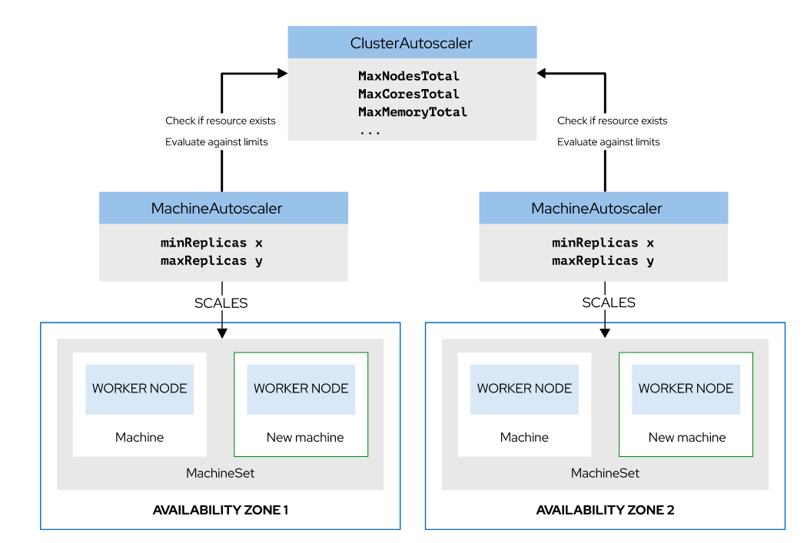

# 6_クラスタスケーリングの設定


コマンドを発行して**クラスター内のワーカーの数**を制御できるようになります。

マシンセットとマシンの関係は、レプリカセットと Pod の関係と同じです。マシンセットには、マシンセット内のすべてのマシンに適用される設定が定義されています。


## クラスタワーカー数を手動で制御する

手動で生業する方法は、2つ

マシンセットリソースの replicas 行を変更するか、oc scale コマンドを使用する

**マシンセット内のマシンの数がレプリカ数と一致しない場合** 、OpenShift は目的のレプリカ数になるまでマシンを追加または削除します。

```
apiVersion: machine.openshift.io/v1beta1
kind: MachineSet
metadata:
  name: ocp-xxyy-worker-us-west-2b
...output omitted...
spec:
  replicas: 1          <- これを変更する
  selector:
    matchLabels:
      machine.openshift.io/cluster-api-cluster: ocp-rnh2q
      machine.openshift.io/cluster-api-machineset: ocp-xxyy-worker-us-west-2b
  template:
    metadata:
      labels:
        machine.openshift.io/cluster-api-cluster: ocp-xxyy
        machine.openshift.io/cluster-api-machine-role: worker
        machine.openshift.io/cluster-api-machine-type: worker
        machine.openshift.io/cluster-api-machineset: ocp-xxyy-worker-us-west-2b
    spec:
      providerSpec:
...output omitted...
          placement:
            availabilityZone: us-west-2b
            region: us-west-2
          credentialsSecret:
            name: aws-cloud-credentials
          instanceType: m4.xlarge
...output omitted...
```

- コマンド
```
oc scale --replicas 2 machineset MACHINE-SET -n openshift-machine-api
```

## クラスタワーカー数を自動的にスケーリングする

クラスターの自動スケーリングでは、**MachineAutoscaler と ClusterAutoscaler の 2 つのカスタムリソース**が使用されます。

- ClusterAutoscaler
```
ノードの合計数などの制限をクラスター全体に適用します。
たとえば、MaxNodesTotal でクラスター全体の最大ノード数を設定し、MaxMemoryTotal でクラスター全体の最大メモリーを設定します。必要に応じて、負荷の減少に合わせてノード数をスケールダウンするように Cluster Autoscaler を設定します。

MachineAutoscalerより上位レベル -> こっちが優先される
```

- MachineAutoscaler
```
負荷に応じてマシンセット内のレプリカの数を自動的にスケーリングします。この API リソースはマシンセットとやり取りして、ワーカーノードをクラスターに追加するように指示します。
リソースは、下限と上限の定義をサポートしています。
```


**MachineSetはクラスター内に複数存在可能**




### 自動スケーリングの実装

必要なものは以下の3つ

1. フルスタック自動化でデプロイされたクラスター (ワーカーを追加または削除するときに、自動スケーリングがクラウドサービスとやり取りする必要があるため)。

2. Cluster Autoscaler リソース (インフラストラクチャでサポートされている場合)。さらに、Cluster Autoscaler リソースによってノードの最大数が制限され、コア、メモリー、GPU の最小値と最大値が定義されます。 Cluster Autoscaler リソースの scaleDown セクションにある enabled: true エントリーは、使用されていないマシンの数をリソースが自動的にスケールダウンすることを許可します。

3. 少なくとも 1 つのマシン自動スケーラーリソース。各マシン自動スケーラーリソースは、**特定のマシンセットの最小および最大レプリカ数を定義**します。

```
apiVersion: "autoscaling.openshift.io/v1beta1"
kind: "MachineAutoscaler"
metadata:
  name: "MACHINE-AUTOSCALER-NAME"
  namespace: "openshift-machine-api"
spec:
  minReplicas: 1
  maxReplicas: 4
  scaleTargetRef:
    apiVersion: machine.openshift.io/v1beta1 kind: MachineSet
    name: MACHINE-SET-NAME
```