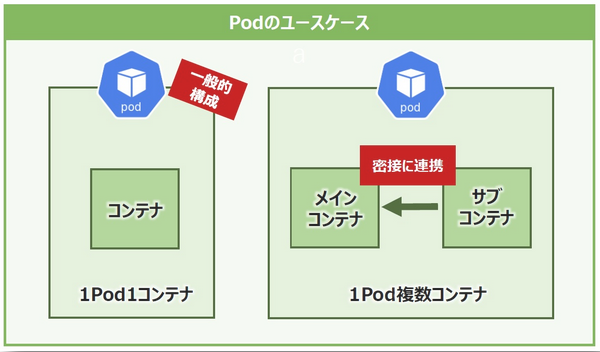

# Kubernetesのコンポーネント

- 参照
    - [Kubernetesのコンポーネント](https://kubernetes.io/ja/docs/concepts/overview/components/)
    - [コンテナを使いこなすための心強い味方!「Kubernetes」(前編)](https://thinkit.co.jp/article/17453)
    - [コンテナを使いこなすための心強い味方!「Kubernetes」(中編)](https://thinkit.co.jp/article/17535)
    - [コンテナを使いこなすための心強い味方! 「Kubernetes」(後編)](https://thinkit.co.jp/article/17629)

---

## コンテナオーケストレーションシステム「Kubernetes」 

2014年、Google社が自社サービスをコンテナ化しており、毎週20億のコンテナを起動していた」こと覚えているでしょうか。これほどまでのスケールになると、様々な問題が出てきます。

システムの運用管理、凄まじい数のコンテナをどのように作成・配置するのか、システムの可用性、スケーリングはどうしていくのか、状態監視をどうするか、などなど。
それらの煩雑なタスクやワークフローを自動化してくれるのが「オーケストレーションシステム」といわれる、いわばオーケストラの指揮者のような存在です。

コンテナマネジメントのデファクトスタンダードが「Kubernetes」である。

### Kubernatesを構成するクラスタとノード

ノードはアプリケーションを実行するマシン。 **ノード自体は一台の物理サーバもしくは仮想マシンと理解してください。**

ノードは、用途によってコンテナの実行ホストを提供する「ワーカーノード」(Worker Node)と、それを管理する「マスターノード」(Master Node)に分かれます。

Kubernetesでは、異なる役割を持つノードの「集まり」をクラスタという形で管理します。クラスタ内には少なくとも1つ以上のマスターノードと１つまたは複数のワーカーノードが存在します。

クラスタを構成することで「**高可用性**」と「**負荷分散**」を実現できます。

- Kubernetesの高可用性

クラスタ内にあるコンテナなどのコンポーネントに障害が発生した場合、当該コンテナを自動で再起動させたり、他のノードでコンテナを起動させ、故障したコンテナが実行していた処理を引き継がせたりと、事前に定義した状態を維持します。

- Kubernetesの負荷分散

特定のノードに処理が集中しないように、ノード間で負荷を自動で分散します。これにより、クラスタ内のシステムリソースを効率よく運用できるようになります

## クラスタの構成要素

上記を実現するために、クラスタの構成要素は、以下のように各ノードに「コンポーネント」という形で配置されます。

## マスターノードとは？

マスターノードはクラスタ内にあるワーカーノードとPodを管理します。

Kubernetesには、クラスタ機能の提供に必要なものとしてコンポーネントと呼ばれるプロセスが実行されますが、その中でもマスターノードで実行されるコンポーネントを **マスターコンポーネント** と言います。

そして、マスターノードはクラスタ全体を管理するために、それぞれ役割を持った複数のマスターコンポーネント(ex. etcd, kube-schedulerなど)によって成り立っているのです。

- マスターコンポーネントの推奨配置 

マスターコンポーネントは、それぞれを別々のノードで起動させることもできますが、マスターコンポーネントだけを同じノードで全て実行させる方法が推奨されています。

マスターコンポーネントはそれぞれが密接に連携してクラスタを管理しており、バラバラに配置すると、あるマスターコンポーネントが実行されているノードに物理的な障害が発生した場合、連携が取れなくなりクラスタの管理機能が停止してしまう恐れがあります。

=> クラスタの稼動継続力(可用性)を高めたい場合は、マスターコンポーネントをそれぞれ1セットとして起動させたマスターノードを複数用意すると良し。

### マスターコンポーネント1：kube-api-server

**kube-api-serverを一言で言うと、「クラスタ内の全ての操作の窓口」になるマスターコンポーネント。**

外部からクラスタを操作する窓口となるAPI(アプリケーションプログラミングインタフェース)を公開しており、管理者はAPIを通じてKubernetesをコントロールする。

kube-api-serverを通してクラスタを操作する際に、ユーザ名や認証情報をリクエストと一緒に送る仕組みになっているのです。
そして、kube-api-serverはユーザ名や認証情報が正しいを照合する「認証」と、受信した操作リクエストが実行可能な権限を持つユーザによるものかを照合する「認可」の役割も備えています。

kube-api-serverの凄いところは認証認可に留まらず、リクエストの中身を確認して受け入れるかどうかを制御する「**入力制御**」の役割も担います。事前に指定した条件に沿わないリクエストはブロックしたり、リクエスト内容の一部の変更を行ったりするのです。

- 補足

API」とは、「Application Programming Interface」

インターフェイスとは、コンピュータ用語でいうと、「何か」と「何か」をつなぐものという意味を持ちます。

APIは、「アプリケーション、ソフトウェア」と「プログラム」をつなぐもの。
APIとはソフトウェアやアプリケーションなどの一部を外部に向けて公開することにより、第三者が開発したソフトウェアと機能を共有できるようにしてくれるものです。

APIを公開する = **ソフトウェアにAPIという外部とやりとりする窓口を作り、外部アプリとコミュニケーションや連携ができる状態にする。**

参考：[今さら聞けないIT用語：やたらと耳にするけど「API」って何？](https://data.wingarc.com/what-is-api-16084)

### マスターコンポーネント2 : etcd

**etcdを一言で言うと、「クラスタ情報の保管庫」となるコンポーネント。**

**Kubernetesクラスタに関する全情報(ノードやPod、構成、アカウントやロールなど)** を保存します。

ノード情報を取得するリクエストが実行されたとき、表示される情報はkube-api-serverがetcdと直接やり取りをして引っ張ってきます。

Kubernetesは多数のノードをクラスタとして管理するため、ノード自体の障害やノード間を繋ぐネットワークに障害が起こってもシステムの継続稼動が求められます。これはetcdも同様です。
etcdは分散された多数のノード間でデータをレプリケート(複製)して保管することに適しており、マスターノードとマスターコンポーネントのセットが複数あっても一貫してクラスタ情報を保てる強みがある。

### マスターコンポーネント3：kube-scheduler

**kube-schedulerは一言で言うと、「Podの配置決め」を行うコンポーネント。**

Podが新しく作成され、どのノードにも配置されなかった場合、schedulerがそれを検知して適切なノードに配置します。このとき、schedulerは、どのPodをどのノードに配置するか**のみ**を担当し、実際にPodを作成するわけではないことに注意。

- Podの配置の決め方

基本的にPodが各ノード間で偏りが出ないように配置します。

または、Podにリソース要件(CPUやメモリ量)などが設定されている場合は、要件を満たすノードを探して配置します。

- 配置決めの例

3つのノードと1つのPodがあるとします。Podはリソース要件として5CPUを設定しており、それぞれノードAは4CPU、ノードBは10CPU、ノードCは15CPUのリソースを持ちます。最初に、schedulerはPodの要件を満たさない4CPUのノードAを配置先候補から外します。次に、Podをノードに配置した際の空きリソース量が大きいノードを計算し、ノードCの方がノードBよりPod配置後の空きリソース量が最も多いため、最終的にノードCにPodを配置します。これらのステップをそれぞれ「**フィルタリング**」「**スコアリング**」と言う。様々な条件を指定可能。

### マスターコンポーネント4：kube-controller-manager

**kube-controller-managerを一言で言うと、様々なコントローラをまとめて実行するコンポーネント。** (コントローラとは、Kubernetesのコンポーネントなどの状態を監視し、必要な対応を実行するプロセス)

- コントローラの例

ノードの状態を監視するノードコントローラは、kube-api-serverを通じて決められた間隔でノードのステータスを確認します。
もし、あるノードに問題が発生し、継続してステータス確認に失敗すると、そのノードに配置されているPodをscheduler経由で正常なノードに再割り当てします。ステータス確認に失敗したノードはschedulerの配置候補の対象から外されます。

コントローラは個別のプロセスですが、それらが1つの実行ファイルに纏められてcontroller-managerとして単一のプロセスで実行される。

### マスターコンポーネント5：cloud-controller-manager

**cloud-controller-managerとは一言で言うと、kubernetesとパブリッククラウドを中継するコンポーネント。**

cloud-controller-managerは、Kubernetesで使用したいリソースと実際にクラウドで使用しているリソースを連携します。

例えば、パブリッククラウドの仮想マシンを利用してKubernetesを実装したとします。その際にクラウドのサービスで提供されているロードバランサーが必要になった場合、クラウド上で実際にロードバランサーを作成し、Kubernetesに関連付ける必要があります。

しかし、本来kubernetesにクラウドを操作する機能はありません。そこでcloud-controller-managerがKubernetesがやりたいことをパブリッククラウドとの間に入り操作の指示を中継することで、Kubernetes上の情報とパブリッククラウド上のリソースとの整合性を保ちます。 **kube-api-serverの代わりにクラウドとの第一窓口になってくれるわけです。**

---

## ワーカーノードとは？

ワーカーノードは、実際にPodを動作させるためのノードです。

ワーカーノードは、Podとノードコンポーネントで成り立っており、マスターノードにより管理されます。

### ノードコンポーネント1：kubelet

**kubeletは、「エージェント」の役割を持つコンポーネント。**

各ノードで動作するKubernetesのエージェントで、Podの起動や管理を担います。

kube-schedulerからのPod配置指示をkube-api-server経由で受け取り、コンテナランタイムを操作してワーカーノード上にPodを作成します。そしてPodやノードの状態を監視してkubeapi-serverにレポートを送信します。

### ノードコンポーネント2：kube-proxy

**kube-proxyとは、「ネットワーキングと負荷分散をサポート」するコンポーネント。**

各ノードで実行され、内部的にはLinuxカーネルのiptablesが利用されています。iptablesは主に通信の許可や遮断の機能と、受信した通信の送信先アドレスを変換し転送する機能などを持ちます。

kube-proxyはこれらを使って通信をPodへ転送するためのノード内のネットワークルールをメンテナンスします。

また、kube-proxyはserviceの機能の一部を実装しています。serviceはクラスタIPという仮想的なIPで負荷分散をします。

### ノードコンポーネント3：コンテナランタイム

**コンテナランタイムとは、ワーカーノードでコンテナを実行するコンポーネント。**

**kubeletから受けた指示を元にコンテナのイメージ取得から実行までを行います。** 
コンテナランタイムは「高レベルランタイム」と「低レベルランタイム」の2層に分かれています。

- 高レベルランタイム

主にコンテナのイメージを取得し、実行するコンテナ環境の設定ファイルなどを作成する。

kubeletから **CRI(Container Runtime Interface)**　
というインターフェイスで呼び出されますが、CRIには高レベルランタイムで行うイメージ取得やコンテナ環境の設定などの定義情報が含まれています。

- 低レベルランタイム

設定ファイルを元に環境の作成やコンテナの実行を行います。

低レベルランタイムは **OCI(Open Container Initiative)** 
に準拠した仕様で高レベルランタイムから呼び出され、高レベルランタイムから受け取った情報を元にコンテナ環境を作成します。
OCIは低レベルランタイムの標準仕様で、設定ファイルを元に作られるNamespaceやcgroupなどの仕様が定められています。

---

## Manifest(マニフェスト)

**Kubernetesでは各種リソース構成や実行するコンテナイメージなどをYAML形式で記述します。それが“Manifest”と呼ばれるファイルです。**

ManifestにKubernetesクラスタの「望ましい状態」を事前に定義し、マスターノードに登録して管理することで、インフラのコード化とも言われる「Infrastructure as Code」を実現しています。

## Kubernetesの中で働くリソース

Kubernetesのリソースとは、Kubernetesの中にコンテナを作り、アプリケーションを動かすための部品です。外部のネットワークへコンテナを公開するまでには、様々な種類のリソースを駆使することになります。

たくさんある。詳細は以下のリンクを参照。

- [コンテナを使いこなすための心強い味方!「Kubernetes」(中編)](https://thinkit.co.jp/article/17535)

## LabelとSelector

KubernetesではPodやService、Deploymentなど様々なリソースを多数作成して管理できますが、数が増えれば増えるほど、どのリソースがどのような用途を想定したものかを把握することは困難になります。

そこで用いられるのが「**Label**」と「**Selector**」です。

Kubernetesでは、リソースの種類やアプリケーションの用途などに応じてLabelとSelectorでグループ化することで、複雑化していく環境をシンプルにできます。

- Label

Podなどのリソースをグループ化します。

- Selector

グループ化された特定のリソースを使用する際に指定します。

## Namespace

Namespaceとは、様々なコンピュータリソースを分離・独立し、お互いの干渉を防ぐためのLinuxカーネルの機能です。

同様に、**KubernetesのNamespaceも複数のワーカーノードを横断して「kubernetesリソース」の分離と独立を制御できます。**

kubernetesで他のリソースに干渉されず安全にコンテナを動かすためには、まず独自の**Namespace(= openshift上のprojectかな)** を作り、コンテナを配置するところからはじまる。

- Kubernetesには環境を作成した時点で3つのNamespaceが用意されています。
    - default：特にどのNamespaceに配置するかを決めていないリソースのためのデフォルト用
    - kube-system：Kubernetesが作成したコンポーネントや管理用のリソース用
    - kube-public：Kubernetesにアクセスする全ユーザーが利用できるように意図的に配置したリソース用

## Pod

各ノードに直接コンテナを起動するのではなく、Podという最小単位で(アプリケーションの)コンテナを実行していきます。

Podには固有の仮想IPアドレスが割り当てられ、**Pod内のコンテナはIPアドレスやポート、ネットワーク名前空間をそれぞれ共有するという特徴があります。**
そのため、Pod内に複数のコンテナが存在する(**非推奨**)場合、コンテナは自身を指定することで(localhost指定)お互いに通信できるのです。

Podのもう1つの特徴はボリュームも共有できることです。
より正確には、Podに共有化されたストレージボリュームを指定することで、Pod内の全てのコンテナがそのストレージにアクセスできるようになる。

**Podとその中のコンテナは「1Pod1コンテナ」構成が一般的とされています。**

例外として、IPアドレスやボリュームなどを同一Pod内のコンテナで共有しコンテナ間で密に連携するようなアプリケーションの場合は、1つのPodに複数のコンテナを収めたほうが良い場合もある。

## ReplicaSet

KubernetesクラスタではノードやPodに障害が発生しても、Podを他のノードに自動で配置し直すなど、事前に定義しておける = **セルフヒーリング**

- ReplicaSet

セルフヒーリングを最もイメージしやすいのが**ReplicaSet** です。

ReplicaSetはどのような時でも事前に指定した数のPodを維持します。

例えば、あるアプリケーションを動作させるPodがあり、管理者はReplicaSetで常に同じPodを2つ維持してほしいと定義します。稼動中、何らかの障害で片方が停止すると、ReplicaSetはすかさず同じPodを新規に作成します。また、ノードに障害が発生し両方のPodが停止した場合でも、事前に定義した数を満たすため、新規で別のノードにPodを作成します。

## Deployment

DeploymentはReplicaSetを管理して、ローリングアップデート(ローリングアップデートとは、簡単に言うと少しずつ(全体ではなく1台ずつのイメージ)新しい物に入れ替えるアップデート方法)やロールバックを実現します。

DeploymentとReplicaSetの関係性を整理すると、ReplicaSetはPod数を管理し、**DeploymentはそのReplicaSetを管理します。**

スーパーマーケットの商品棚を例に挙げると、ReplicaSetの入れ替えでは一時的に棚が空になりますが、Deploymentのローリングアップデートでは商品が少しずつ入れ替わるため棚が空にならないというメリットがあります。つまり、**アプリケーションに接続できない状態が発生しないということになります。**

## Service

**ServiceはKubernetesのクラスタ内外からのPod宛の通信を仮想IPアドレスで振り分けてくれるリソースです。**

- なぜServiceが必要なのか？

何かしらの障害でPodが停止するとReplicaSetなどによりSelf-Healingされて稼動を継続できるようになっていますが、復活した後のPodに割り振られたIPアドレスが変わってしまい、稼動を停止したPodのIPアドレスにたどり着けず通信が途絶えてしまう問題があります。

この問題を解決するのがServiceです。Podの論理セットの前段にServiceというプロダクションを構え、Podへアクセスするためのポリシーを定義し、リクエストを受け付けるロードバランサーの役割を担います。

## PersistentVolume(PV)とPersistentVolumeClaim(PVC) 

Podが停止・再配置されてもアプリケーションの状態を維持するため、Podからマウントする永続なストレージボリュームが必要になります。

Kubernetesではそれを確保するために「PersistentVolume(PV)」と「PersistentVolumeClaim(PVC)」というリソースを提供しています。

**PVはPodのデータを保存する永続ストレージの本体** で、**PVCは必要なストレージ容量を動的に確保する抽象化したストレージ** です。

## ConfigMap

**Podやコンテナの設定値と設定ファイルを保存するためのリソース**

Podの実行時に必要な環境変数、ポート番号などの構成要素をConfigMapによりPodから分離して保存することでワークロードの移植性が向上し、構成の管理や変更が楽になる。

---

## RBAC(Role Base Access Control) 

名前の通り個々のユーザーのアカウントではなくロール(役割)を軸にポリシーを柔軟に設定できるアクセス制御方法です。

ユーザーの権限は直接割り当てられるのではなく、ロールを通じて取得するだけなので、個々のユーザーのアカウントに適切なロールを割り当てることでユーザー権限を管理します。このような方法により、ユーザーの追加や部署変更などの一般的な操作が簡単になります。

RBACのイメージ図

#### kubernetesのRBAC関連のリソース

RBACに関連するリソースにはRole、ClusterRole、RoleBinding、ClusterRoleBindingがあり、それぞれ与える影響範囲と機能が異なります。

RoleとClusterRoleは、どのKubernetesのリソースにどのような操作を許可するかを定義

RoleBinding(紐付け)とClusterRoleBindingは、どのRoleやClusterRoleをどのアカウントに紐付けるかを定義します。

## Kubernetesの周辺ツール

### Helm

Kubernetes向けのパッケージマネージャにあたる

「Helm is the best way to find, share, and use software built for Kubernetes.」(訳:Helmは、Kubernetesのために構築されたソフトウェアを検索・共有・使用するための最良の方法です)。

パッケージマネージャは、OS上にソフトウェアをインストール／アンインストールする際にソフトウェア間やライブラリとの依存関係を包括管理してくれます。ディストリビューションによって違いはありますが、Linuxでは「yum」や「apt」が有名。

Helmは「 **Chart** 」と呼ばれるパッケージテンプレートを用いてソフトウェア構成を定義。

HelmによってChart化されているアプリケーションであれば、**複雑な記述が必要なManifestファイルを用意しなくても、コマンド1つで容易にKubernetes上にアプリケーションをデプロイできるようになる。**

### CoreDNS

webサイトなどにアドレスバーにIPアドレスを打ち込んでアクセスすることもできますが、普段からアクセスするサイトのIPアドレスを覚えておくことは難しいでしょう。

この問題を解決するために「DNS」と呼ばれる仕組みがあります。DNSサーバはDNSレコードを元にIPアドレスとURL(正確にはドメイン部分)を相互変換するサービスです。普段私たちがURLを使って簡単にWebサイトへアクセスできるのは、このDNSサーバがIPアドレスに変換してくれるおかげです。

KubernetesクラスタにおいてDNSの役割を果たしてくれているコンポーネントが「CoreDNS」。

CoreDNSの特徴は非常に軽量なこと、プラグイン方式を採用することでetcdやhostsなどの様々なバックエンドに設定を格納・管理できる拡張性の高さです。Kubernetesにおいても、デフォルトでConfigMapに設定情報を格納したり、etcdを利用すればコマンド1つで設定情報を編集できたりなど、様々な展開方法があります。

またKubernetesクラスタ内にCoreDNS用のPodを複数展開することで、CoreDNSへのDNSリクエストを分散させて処理能力を向上でき、クラスタのSelf-Healing機能を利用して高可用性を確保することも可能。

### Prometheus

動的なサービスにも監視できる「Prometeus」

特徴はPull型という監視方法を採用している点です。**従来の固定的なサーバだけでなく、オートスケール機能を搭載したサーバ群やコンテナ群など、動的な対象の監視を得意とする。**

Agent型は監視対象サーバにAgentを組み込み、Agentが取得した情報を監視サーバに送ることで監視する。Prometeusは監視サーバが自ら監視対象サーバの情報を取得しに行くPull型監視方式を採用しています。例えるなら監視カメラによる監視と似たようなものです。

#### Prometheusの仕組み

Prometheusには、**監視対象のサーバやコンテナに導入するexporter** と、**監視サーバに入れるPrometheusサーバ** があります。

- exporter

監視したい対象ごとに分かれて動作します。例えば、監視対象サーバのCPUのリソース情報を取得したい場合には、CPU用のexporterを入れることで監視できます。また、ApacheやTomcatなどのミドルウェアの情報も取得できるなど、監視対象の種類は多岐に渡ります。コンテナの場合もexporterを各コンテナに入れることで監視できます。

- Prometheusサーバ

監視対象から取得した情報の取りまとめをします。以下の3つのコンポーネントがあります。

1. リソース情報をexporterから取得する役割を持つ「**Retrieval**」

2. 取得したリソース情報を格納する「**Storage**」

3. リソース情報を可視化する「**PromQL**」 (PromQLは単純なグラフしか出力されず非常に見づらいため、「Grafana」や「Kibana」などサードパーティの可視化ツールを使用してPromQLの欠点を補う。)

- コンテナへのインストール方法

コンテナにPrometheusをインストールするには複数の方法があります。

1. サーバのようにコンテナに組み込んで起動させる方法です。しかし、この方法ではコンテナが再起動されるとインストールした情報が消える。

2. Prometheus専用のpodをそのままデプロイし、クラスタ上で稼動させるという方法です。この方法であれば、1.の方法の欠点を補うことができます。

### Fluentd

コンテナを利用してアプリケーションを継続的に稼動させるには、運用の観点でいくつか考慮しないといけないところはありますが、その中でとりわけ重要なのは「 **ログデータの管理** 」です。

**クラスタをより良く管理・運用するためには、コンテナのログデータを効率的に収集してデータストアに格納し、集中管理で問題を発見するために閲覧できる一連の仕組み** の定番

Dockerにはコンテナ内プロセスのログ情報(標準出力と標準エラー出力)をJSON形式でログファイルに保存する機能がありますが、予期せぬ障害でコンテナが落ちてしまった場合に、ログファイルも一緒に破棄されてしまうという欠点があります。

また、Dockerホストを複数台で運用するような大規模なコンテナ環境では、それぞれのホスト上で個別にログファイルを管理することは困難なため、ログ情報を外部へ転送して集中管理する機構が必要となります。

このような課題を解決するため、Dockerにはログの転送を補助する「 **Logging driver** 」機能を備えています。

Logging driverをFluentdに指定することで、構造化したログデータは一旦Fluentdに送信されます。

また、Fluentdの出力プラグインを用いて収集したログデータを様々な形式に変換して保存することもでき、保存先には外部のストレージやAmazon S3、Google Cloud Storageといったパブリッククラウドのオブジェクトストレージも指定できる。

